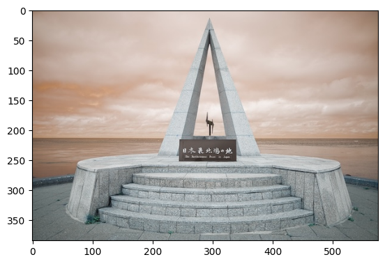
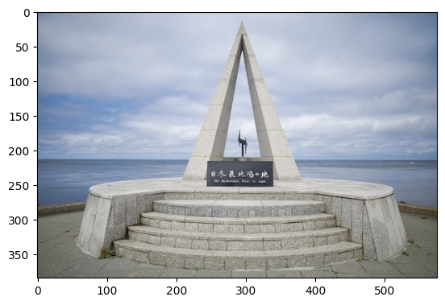
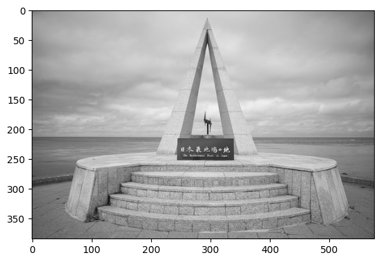
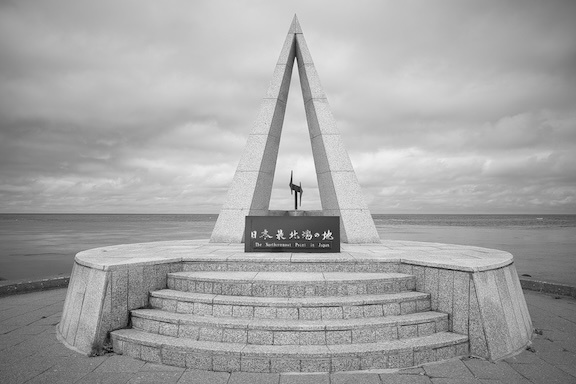
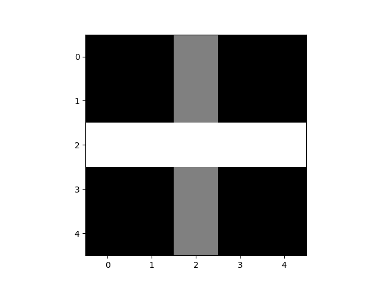
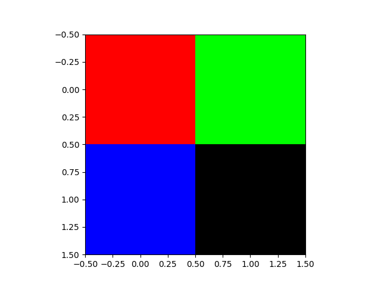

### ライブラリ
- Pythonにはライブラリとよばれる「プログラムの集まり」が用意されている
- このライブラリを利用することで，様々な機能を持つプログラムを簡単に作成できるようになる

- 標準ライブラリ
  - Pythonをインストールした際に付属しているライブラリ
    - 例: ``math``（数学機能），``random``（乱数機能）

- 外部ライブラリ
  - 新たにダウンロードしてインストールが必要なライブラリ
    - 例: ``matplotlib``（グラフ機能），``pytorch``（深層学習），``opencv``（画像処理）

- ライブラリの使用例
  - ライブラリを導入する場合，最初に『``import ライブラリ名``』と書く
  - ライブラリに含まれる機能を使用するには，ドット ``.`` を打ち，機能名を続けることで使用することができる

- サンプルプログラム
```python
# 累乗と平方根を求めるmathライブラリのpow()，sqrt()の使用例
import math # mathライブラリの導⼊
# math.pow(a, b) # aのb乗
print(math.pow(2, 5)) # 2の5乗
# math.sqrt(a) # ルートa
print(math.sqrt(2)) # 2の平⽅根（ルート2）
```
  - ``as`` を使用することで，ライブラリに別名をつけて使用できる

- サンプルプログラム
```python
# mathライブラリをmという別名をつけた場合における
# 累乗と平方根を求めるpow()，sqrt()の使用例
import math as m   # mathライブラリをmとして導⼊
print(m.pow(2, 5)) # 2の5乗
print(m.sqrt(2))   # 2の平⽅根（ルート2）
```

###  opencvの画像読み込み
- opencvライブラリであるcv2をimportする
- ```変数名 = cv2.imread(画像ファイル)を使用する```
  - ファイル名は文字列とする
  - ファイルは同じフォルダに置いておく
```python
import cv2
画像変数 = cv2.imread(画像ファイル名)
```
###  変数に読み込みした画像の表示
- ``matplot``ライブラリを使用する
  - ``import matplotlib.pyplot as plt``でimportする
  - ``plt.imshow(変数名)``と``plt.show()``を使用する

```python
import matplotlib.pyplot as plt # ライブラリの導⼊
plt.imshow(画像変数)
plt.show()
```

- 入力画像を``soya.jpeg``とする


- サンプルプログラム
```python
import cv2
import matplotlib.pyplot as plt
# imageが画像変数
image = cv2.imread('soya.jpeg')
plt.imshow(image)
plt.show()
```



### OpenCVで画像を読み込む際の注意

- OpenCVで画像を読み込む際，**RGB（赤緑青）の順番で画素値を読むのでは無く，BGR（青緑赤）の順番で画素値を読む**ため， BGRからRGBとなるように，画素値を入れ替える必要がある
  - そこで，``cv2.cvtColor``を使用する
    - 読み込んだ色の順番の変更を行う
  - ``cv2.COLOR_BGR2RGB``がBGRからRGBに変換する命令

```python
画像変数 = cv2.cvtColor(画像変数, cv2.COLOR_BGR2RGB)
```

- サンプルプログラム
```python
import cv2
import matplotlib.pyplot as plt
image = cv2.imread('soya.jpeg')
image = cv2.cvtColor(image, cv2.COLOR_BGR2RGB)
plt.imshow(image)
plt.show()
```


### グレー画像の変換
- カラー画像からグレースケール画像に変更する際も，``cv2.cvtColor``を使用する
  - BGRからグレースケールに変換する``cv2.COLOR_BGR2GRAY``やRGBからグレースケールに変換する``cv2.COLOR_RGB2GRAY``を指定する
  - ただし，**matplotlibはカラー画像を標準で出力する**ため，``plt.gray()``を画像表示前に追加する

- サンプルプログラム（BGR → GRAYでグレー変換）
```python
import cv2
import matplotlib.pyplot as plt
image = cv2.imread('soya.jpeg')
image = cv2.cvtColor(image, cv2.COLOR_BGR2GRAY) # BGR → グレー
plt.imshow(image)
plt.gray()
plt.show()
```


- サンプルプログラム（BGR → RGB → GRAYでグレー変換）
```python
import cv2
import matplotlib.pyplot as plt
image = cv2.imread('soya.jpeg')
image = cv2.cvtColor(image, cv2.COLOR_BGR2RGB)  # BGR → RGB
image = cv2.cvtColor(image, cv2.COLOR_RGB2GRAY) # RGB → グレー
plt.imshow(image)
plt.gray()
plt.show()
```


### opencvの画像の出力（保存）
- 変数に保存されている画素値の画像をファイル出力する
- ``cv2.imwrite(保存ファイル名, 変数名)``を使用する
- ファイル名は文字列とする

- サンプルプログラム
```python
import cv2
import matplotlib.pyplot as plt
image = cv2.imread('soya.jpeg')
image = cv2.cvtColor(image, cv2.COLOR_BGR2GRAY) # BGR → グレー
cv2.imwrite('soya-result.jpeg', image) # ファイル書き出し
plt.imshow(image)
plt.gray()
plt.show()
```
- 以下の``soya-result.jpeg``が出力される


- 有名な画像フォーマット形式を扱えることができる
  - BMP形式（拡張子: ``bmp``）
  - JPEG形式（拡張子: ``jpeg`` または ``jpg``）
  - PNG形式（拡張子: ``png``）
  - PGM形式（拡張子: ``pgm``）
  - PPM形式（拡張子: ``ppm``）
  - TIFF（拡張子: ``tiff`` または ``tif``）

### PGM形式ファイルの読み込み
- 画像ファイル``test.pgm``（拡大図）


- ``test.pgm``の中身
  
```
P2
5 5
255
0   0   128 0   0
0   0   128 0   0
255 255 255 255 255
0   0   128 0   0
0   0   128 0   0

```

- サンプルプログラム
```python
import cv2
import matplotlib.pyplot as plt
image = cv2.imread('test.pgm')
image = cv2.cvtColor(image, cv2.COLOR_BGR2GRAY) # BGR → グレー
plt.imshow(image)
plt.gray()
plt.show()
```

- 出力結果



### PPM形式ファイルの読み込み
- 画像ファイル``test.ppm``（拡大図）


- ``test.ppm``の中身

```
P3
2 2
255
255 0   0   0   255 0
0   0   255 0   0   0

```

- サンプルプログラム
```python
import cv2
import matplotlib.pyplot as plt
image = cv2.imread('test.ppm')
image = cv2.cvtColor(image, cv2.COLOR_BGR2RGB) # BGR → RGB
plt.imshow(image)
plt.show()
```

- 出力結果


