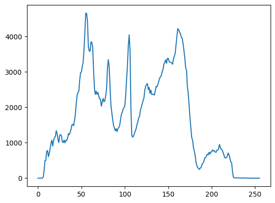

### 画素値のヒストグラム作成

- グレースケール画像の場合
    1. opencvをimportする: ``import cv2``
    2. matplotlibをimportする: ``import matplotlib.pyplot as plt``
    3. 白黒変換した画像を変数に代入する
    4. 白黒変換した画像に対して，``ヒストグラムデータ変数 = cv2.calcHist([白黒変換した画像変数], [0], None, [256], [0,256])``とする
    5. ヒストグラムデータがヒストグラムデータ変数に代入される
    6. ``plt.plot(ヒストグラムデータ変数)``と``plt.show()``を使用してヒストグラムを表示する

- 入力画像: ``nikka.jpeg``


- サンプルプログラム
```python
import cv2
import matplotlib.pyplot as plt

image = cv2.imread('nikka.jpeg')
image = cv2.cvtColor(image, cv2.COLOR_BGR2GRAY) # BGR → グレー
hist = cv2.calcHist([image], [0], None, [256], [0,256])
plt.plot(hist)
plt.show()
```
- 出力結果



- 横軸が画素値，縦軸が出現回数
  - ``print(hist[画素値])``でその画素値の度数がわかる

- サンプルプログラム
```python
import cv2
import matplotlib.pyplot as plt

image = cv2.imread('nikka.jpeg')
image = cv2.cvtColor(image, cv2.COLOR_BGR2GRAY) # BGR → グレー
hist = cv2.calcHist([image], [0], None, [256], [0,256])

# 画素値の出現回数を表示
print(hist[0])
print(hist[32])
print(hist[64])
print(hist[128])
print(hist[255])

plt.plot(hist)
plt.show()
```
- 出力結果
```
[0.]
[1070.]
[3052.]
[2562.]
[0.]
```


- ``plt.plot(hist, color=色文字列)``とすることで，描画の色を変更できる
  - ``'r'`` : 赤
  - ``'g'`` : 緑
  - ``'b'`` : 青
  - ``'c'`` : シアン（水色）
  - ``'m'`` : マゼンタ（赤紫）
  - ``'y'`` : 黄
  - ``'k'`` : 黒
  - ``'w'`` : 白
- ``plt.plot(hist, label=ラベル文字列)``とすることで，グラフに名前（凡例）を付けることができる
  - **名前は英数字で書くこと（matplotlibは日本語を扱えない）**
  - 凡例を表示する場合，``plt.legend()``を付ける
- グラフのタイトル，ラベルを指定する
  - **英数字で書くこと（matplotlibは日本語を扱えない）**
  - ``plt.title('文字列')`` : グラフのタイトルを指定した文字列にする
  - ``plt.xlable('文字列')`` : x軸のラベルを指定した文字列にする
  - ``plt.ylable('文字列')`` : y軸のラベルを指定した文字列にする

```python
import cv2
import matplotlib.pyplot as plt
image = cv2.imread('nikka.jpeg')
image = cv2.cvtColor(image, cv2.COLOR_BGR2GRAY) # BGR → グレー
hist = cv2.calcHist([image], [0], None, [256], [0,256])
plt.title('Histogram')    # タイトル名を付ける
plt.xlabel('Pixel value') # 横軸名を付ける
plt.ylabel('Frequency')   # 縦軸名を付ける
plt.plot(hist, color='k', label='Frequency') # グラフのラベルと色を付ける
plt.legend() # 凡例を付ける
plt.show()
```
- 出力結果


- カラー画像の場合（RGBの3種類のヒストグラム）
  1. opencvをimportする: ``import cv2``
  2. matplotlibをimportする: ``import matplotlib.pyplot as plt``
  3. 画像データを変数に代入する
  4. BGRからRGBに変換した画像に対して，``ヒストグラムデータ変数 = cv2.calcHist([白黒変換した画像変数], [i], None, [256], [0,256])``とする
     - ``i``が0: 赤の画素値
     - ``i``が1: 緑の画素値
     - ``i``が2: 青の画素値
  5. ヒストグラムデータがヒストグラムデータ変数に代入される
  6. ``plt.plot(ヒストグラムデータ変数)``と``plt.show()``を使用してヒストグラムを表示する

- サンプルプログラム
```python
import cv2
import matplotlib.pyplot as plt
image = cv2.imread('nikka.jpeg')
image = cv2.cvtColor(image, cv2.COLOR_BGR2RGB)
# 赤の画素値に関するヒストグラム
hist_red = cv2.calcHist([image], [0], None, [256], [0,256])

# 緑の画素値に関するヒストグラム
hist_green = cv2.calcHist([image], [1], None, [256], [0,256])

# 青の画素値に関するヒストグラム
hist_blue = cv2.calcHist([image], [2], None, [256], [0,256])

# 3つのヒストグラムを色を変えて表示する
plt.plot(hist_red, color='r', label='Red Frequency')
plt.plot(hist_green, color='g', label='Green Frequency')
plt.plot(hist_blue, color='b', label='Blue Frequency')

plt.title('Histogram')
plt.xlabel('Pixel value')
plt.ylabel('Frequency')

plt.legend()
plt.show()
```

- 出力結果


### ヒストグラム均一化
1. opencvをimportする: ``import cv2``
2. matplotlibをimportする: ``import matplotlib.pyplot as plt``
3. 白黒変換した画像を変数に代入する
4. 白黒変換した画像に対して，``ヒストグラム均一化変数 = cv2.equalizeHist(白黒変換した画像変数)``とする
   - ``cv2.equalizeHist``がヒストグラム均一化する命令
   - ヒストグラム均一化変数にヒストグラム均一化された画素値が代入される
5. ``plt.imshow(ヒストグラム均一化変数)``と``plt.show()``を使用してヒストグラムを表示する

- ヒストグラム均一化に適用する入力画像（soya-gray.jpeg）


- サンプルプログラム
```python
# ヒストグラム均一化
import cv2
import matplotlib.pyplot as plt
image = cv2.imread('soya-gray.jpeg')
image = cv2.cvtColor(image, cv2.COLOR_BGR2GRAY) # BGR → グレー
after_image = cv2.equalizeHist(image) # ヒストグラム均一化
plt.imshow(after_image)
plt.gray()
plt.show()
```

- ヒストグラム均一化画像


#### 入力画像のヒストグラム
- サンプルプログラム
```python
import cv2
import matplotlib.pyplot as plt
image = cv2.imread('soya-gray.jpeg')
image = cv2.cvtColor(image, cv2.COLOR_BGR2GRAY) # BGR → グレー
hist = cv2.calcHist([image], [0], None, [256], [0,256])
plt.plot(hist)
plt.show()
```

- 出力結果


#### ヒストグラム均一化後のヒストグラム
- サンプルプログラム
```python
# ヒストグラム均一化した画像における画素値分布
import cv2
import matplotlib.pyplot as plt
image = cv2.imread('soya-gray.jpeg')
image = cv2.cvtColor(image, cv2.COLOR_BGR2GRAY) # BGR → グレー
after_image = cv2.equalizeHist(image) # ヒストグラム均一化
hist = cv2.calcHist([after_image], [0], None, [256], [0,256])
plt.plot(hist)
plt.show()
```

- 出力結果

