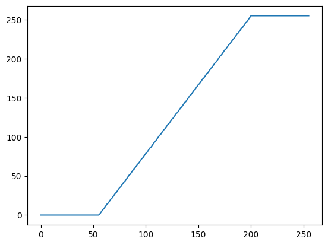
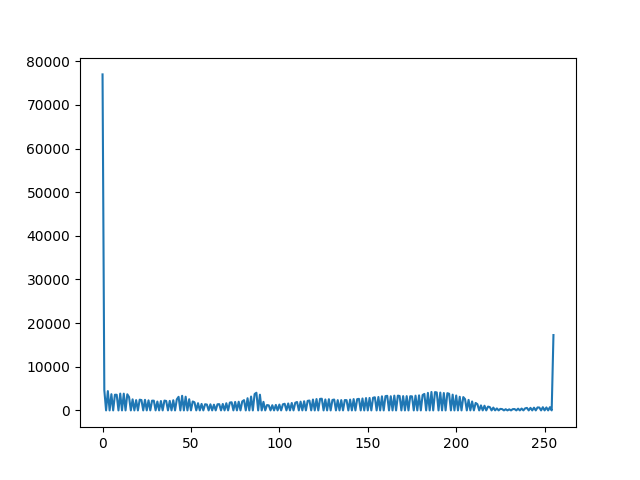
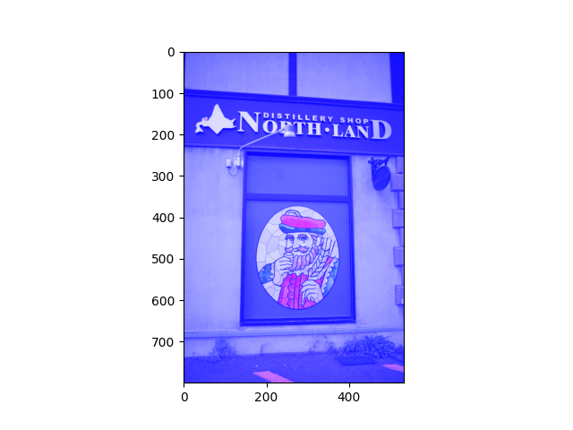

### トーンカーブによる画像変換
- 以下に示すような，画素値の対応表でるLUT（ルックアップテーブル）を構築する

| 入力画像（変換前）の画素値 | 補正画像（変換後）の画素値 |
| ---- | ---- |
| 0 | 255 |
| 1 | 254 |
| 2 | 253 |
| 3 | 252 |
| 4 | 251 |
| ･･･ | ･･･ |
| 255 | 0 |

- まず，入力画像（変換前）の画素値テーブルを用意する
  1. ``numpy``ライブラリを使用する: ``import numpy as np``
  2. ``変換前画素値テーブル変数 = np.arange(256)``
    - これにより，``0, 1, 2, ･･･，254, 255``のルックアップテーブルを作成できる

##### matplotlibで変換前の画素値テーブルをプロットする
- サンプルプログラム
```python
import numpy as np
import matplotlib.pyplot as plt
before_pixel_value = np.arange(256)
plt.plot(before_pixel_value)
plt.show()
```

- 出力画像


- ``np.arange(256)``で定義した場合，numpyのルールで一括に全要素を操作できるため，これを利用して，変換後の画素値テーブルを取得できる
  - 例: ``補正画像（変換後）の画素値 = 255 - 入力画像（変換前）の画素値 # 各要素に対して，255から引いた値にする``
- 変換後の画素値の値が小数になる可能性があるので，``補正画像（変換後）の画素値 = 補正画像（変換後）の画素値.astype(np.uint8)``のように書いて，小数を整数に直す

##### matplotlibで変換後の画素値テーブルをプロットする
- サンプルプログラム
```python
import numpy as np
import matplotlib.pyplot as plt
before_pixel_value = np.arange(256)
after_pixel_value = 255 - before_pixel_value # 各要素に対して，255から引いた値にする
after_pixel_value = after_pixel_value.astype(np.uint8)
plt.plot(after_pixel_value)
plt.show()
```

- 出力画像


### ルックアップテーブルを適用する
1. cv2をimportする: ``import cv2``
2. ``変換後の画像変数 = cv2.LUT(変換前の画像変数, 変換後の画素値テーブル)``

- ネガポジ変換の場合
  - 各要素に対して，255から引いた値にする
  - 数式: $$変換後の画素（補正画像） = 255 - 変換前の画素（入力画像）$$
  ```python
  # ネガポジ変換用ルックアップテーブル作成
  before_pixel_value = np.arange(256)          # 変換前
  after_pixel_value = 255 - before_pixel_value # 変換後
  after_pixel_value = after_pixel_value.astype(np.uint8)
  ```

- サンプルプログラム（入力画像: ``nikka.jpeg``）
```python
import numpy as np
import cv2
import matplotlib.pyplot as plt

# 画像読み込み
image = cv2.imread('nikka.jpeg')
image = cv2.cvtColor(image, cv2.COLOR_BGR2GRAY) # BGR → グレー

# ルックアップテーブルを作成する
before_pixel_value = np.arange(256) # 変換前
after_pixel_value = 255 - before_pixel_value # 変換後
after_pixel_value = after_pixel_value.astype(np.uint8)

# 画像変換を行う
after_image = cv2.LUT(image, after_pixel_value)

# 画像表示
plt.imshow(after_image)
plt.gray()
plt.show()
```

- 出力結果


### 画素値ヒストグラム
- ``nikka.jpeg``


- ネガポジ変換後の場合
  - サンプルプログラム
  ```python
  # 変換後画像の画素値ヒストグラム
  import cv2
  import numpy as np
  import matplotlib.pyplot as plt
  
  # 画像読み込み
  image = cv2.imread('nikka.jpeg')
  image = cv2.cvtColor(image, cv2.COLOR_BGR2GRAY) # BGR → グレー
  
  # ルックアップテーブルを作成する
  # ネガポジ変換
  before_pixel_value = np.arange(256) # 変換前
  after_pixel_value = 255 - before_pixel_value # 変換後
  after_pixel_value = after_pixel_value.astype(np.uint8)
  
  # 画像変換を行う
  after_image = cv2.LUT(image, after_pixel_value)
  
  # ヒストグラム作成
  hist = cv2.calcHist([after_image], [0], None, [256], [0,256])

  # グラフ表示
  plt.plot(hist)
  plt.show()
  ```
- 出力結果（ヒストグラムが左右逆転している）


### 折れ線型トーンカーブ
- 入力画像の画素値0から $a$ を0にし，入力画像の画素値 $b$ から255を255にする画像変換
- 入力画像の画素値 $a$ から $b$ を直線（1次関数）的に変換する

  ```python
  # 折れ線型トーンカーブ用ルックアップテーブル作成（a ≦ bとなるように値を設定する）
  a = 55
  b = 200
  before_pixel_value = np.arange(256)
  after_pixel_value = 255 * (before_pixel_value - a) / (b - a)
  after_pixel_value = np.clip(after_pixel_value, 0, 255)
  after_pixel_value = after_pixel_value.astype(np.uint8)
  ```

##### matplotlibでプロットする
- サンプルプログラム
```python
import numpy as np
import matplotlib.pyplot as plt
a = 55
b = 200

before_pixel_value = np.arange(256)
after_pixel_value = 255 * (before_pixel_value - a) / (b - a)
after_pixel_value = np.clip(after_pixel_value, 0, 255)
after_pixel_value = after_pixel_value.astype(np.uint8)

plt.plot(after_pixel_value)
plt.show()
```

- 出力結果


- サンプルプログラム（折れ線型トーンカーブ用ルックアップテーブルを適用する）
```python
import numpy as np
import cv2
import matplotlib.pyplot as plt

# 画像読み込み
image = cv2.imread('nikka.jpeg')
image = cv2.cvtColor(image, cv2.COLOR_BGR2GRAY) # BGR → グレー

# ルックアップテーブルを作成する
a = 55
b = 200
before_pixel_value = np.arange(256)
after_pixel_value = 255 * (before_pixel_value - a) / (b - a)
after_pixel_value = np.clip(after_pixel_value, 0, 255)
after_pixel_value = after_pixel_value.astype(np.uint8)

# 画像変換を行う
after_image = cv2.LUT(image, after_pixel_value)

# 画像表示
plt.imshow(after_image)
plt.gray()
plt.show()
```

- 出力結果


##### 変換後画像の画素値ヒストグラム

```python
import cv2
import numpy as np
import matplotlib.pyplot as plt

# 画像読み込み
image = cv2.imread('nikka.jpeg')
image = cv2.cvtColor(image, cv2.COLOR_BGR2GRAY) # BGR → グレー

# ルックアップテーブルを作成する
a = 55
b = 200
before_pixel_value = np.arange(256)
after_pixel_value = 255 * (before_pixel_value - a) / (b - a)
after_pixel_value = np.clip(after_pixel_value, 0, 255)
after_pixel_value = after_pixel_value.astype(np.uint8)

# 画像変換を行う
after_image = cv2.LUT(image, after_pixel_value)

# ヒストグラム作成
hist = cv2.calcHist([after_image], [0], None, [256], [0,256])

# グラフ表示
plt.plot(hist)
plt.show()
```

- 出力結果（画素値0と255が増えていることがわかる）


### ガンマ変換
- グレースケール画像のすべての画素値に関して，以下の式を適用する
- $変換後の画素（補正画像） = 255 * (\\frac{変換前の画素（入力画像）}{255})^{\\frac{1}{\\gamma}}$

  ```python
  # ガンマ変換用ルックアップテーブル作成（γの値を適宜設定する）
  gamma = 3.0
  before_pixel_value = np.arange(256)
  after_pixel_value = 255 * (before_pixel_value / 255) ** (1 / gamma)
  after_pixel_value = after_pixel_value.astype(np.uint8)
  ```

##### matplotlibでプロットする
- サンプルプログラム
```python
import numpy as np
import matplotlib.pyplot as plt
gamma = 3.0
before_pixel_value = np.arange(256)
after_pixel_value = 255 * (before_pixel_value / 255) ** (1 / gamma)
after_pixel_value = after_pixel_value.astype(np.uint8)
plt.plot(after_pixel_value)
plt.show()
```

- 出力結果


##### γの値によるトーンカーブの違い
- サンプルプログラム
```python
import numpy as np
import matplotlib.pyplot as plt
gamma1 = 3.0
gamma2 = 2.0
gamma3 = 1.5
gamma4 = 1.0
gamma5 = 2/3
gamma6 = 1/2
gamma7 = 3/10

before_pixel_value = np.arange(256)

after_pixel_value1 = 255 * (before_pixel_value / 255) ** (1 / gamma1)
after_pixel_value1 = after_pixel_value1.astype(np.uint8)

after_pixel_value2 = 255 * (before_pixel_value / 255) ** (1 / gamma2)
after_pixel_value2 = after_pixel_value2.astype(np.uint8)

after_pixel_value3 = 255 * (before_pixel_value / 255) ** (1 / gamma3)
after_pixel_value3 = after_pixel_value3.astype(np.uint8)

after_pixel_value4 = 255 * (before_pixel_value / 255) ** (1 / gamma4)
after_pixel_value4 = after_pixel_value4.astype(np.uint8)

after_pixel_value5 = 255 * (before_pixel_value / 255) ** (1 / gamma5)
after_pixel_value5 = after_pixel_value5.astype(np.uint8)

after_pixel_value6 = 255 * (before_pixel_value / 255) ** (1 / gamma6)
after_pixel_value6 = after_pixel_value6.astype(np.uint8)

after_pixel_value7 = 255 * (before_pixel_value / 255) ** (1 / gamma7)
after_pixel_value7 = after_pixel_value7.astype(np.uint8)

plt.plot(after_pixel_value1, color='r', label='gamma = 3.0')
plt.plot(after_pixel_value2, color='g', label='gamma = 2.0')
plt.plot(after_pixel_value3, color='b', label='gamma = 1.5')
plt.plot(after_pixel_value4, color='c', label='gamma = 1.0')
plt.plot(after_pixel_value5, color='m', label='gamma = 2/3')
plt.plot(after_pixel_value6, color='y', label='gamma = 1/2')
plt.plot(after_pixel_value7, color='k', label='gamma = 3/10')

plt.legend()
plt.show()
```

- 出力結果


-  一般的に，ガンマの値が1より大きいと，明るくする画像変換
  - サンプルプログラム（γ=3.0）
  ```python
  import numpy as np
  import cv2
  import matplotlib.pyplot as plt
  
  # 画像読み込み
  image = cv2.imread('nikka.jpeg')
  image = cv2.cvtColor(image, cv2.COLOR_BGR2GRAY) # BGR → グレー
  
  # ルックアップテーブルを作成する
  gamma = 3.0
  before_pixel_value = np.arange(256)
  after_pixel_value = 255 * (before_pixel_value / 255) ** (1 / gamma)
  after_pixel_value = after_pixel_value.astype(np.uint8)
  
  # 画像変換を行う
  after_image = cv2.LUT(image, after_pixel_value)
  
  # 画像表示
  plt.imshow(after_image)
  plt.gray()
  plt.show()
  ```

  - 出力結果
  


-  一般的に，ガンマの値が1より小さいと，暗くする画像変換
  - サンプルプログラム（γ=0.5）
  ```python
  import numpy as np
  import cv2
  import matplotlib.pyplot as plt
  
  # 画像読み込み
  image = cv2.imread('nikka.jpeg')
  image = cv2.cvtColor(image, cv2.COLOR_BGR2GRAY) # BGR → グレー
  
  # ルックアップテーブルを作成する
  gamma = 0.5
  before_pixel_value = np.arange(256)
  after_pixel_value = 255 * (before_pixel_value / 255) ** (1 / gamma)
  after_pixel_value = after_pixel_value.astype(np.uint8)
  
  # 画像変換を行う
  after_image = cv2.LUT(image, after_pixel_value)
  
  # 画像表示
  plt.imshow(after_image)
  plt.gray()
  plt.show()
  ```
  - 出力結果
  

### ポスタリゼーション
- 階層数（``level``）の値を設定することで，以下のようなプログラムでルックアップテーブルを作成可能
  ```python
  # ポスタリゼーション用ルックアップテーブル作成（levelの値を適宜設定する）
  level = 8 # 8段階
  before_pixel_value = np.arange(256)
  after_pixel_value = before_pixel_value // (256 / level) * 255 / (level - 1)
  after_pixel_value = after_pixel_value.astype(np.uint8)
  ```
##### matplotlibでプロットする
- サンプルプログラム
```python
import numpy as np
import matplotlib.pyplot as plt
level = 8 # 8段階
before_pixel_value = np.arange(256)
after_pixel_value = before_pixel_value // (256 / level) * 255 / (level - 1)
after_pixel_value = after_pixel_value.astype(np.uint8)
plt.plot(after_pixel_value)
plt.show()
```
- 出力結果


- サンプルプログラム（ポスタリゼーション適用した画像を表示する）
```python
import numpy as np
import cv2
import matplotlib.pyplot as plt

# 画像読み込み
image = cv2.imread('nikka.jpeg')
image = cv2.cvtColor(image, cv2.COLOR_BGR2GRAY) # BGR → グレー

# ルックアップテーブルを作成する
level = 8 # 8段階
before_pixel_value = np.arange(256)
after_pixel_value = before_pixel_value // (256 / level) * 255 / (level - 1)
after_pixel_value = after_pixel_value.astype(np.uint8)

# 画像変換を行う
after_image = cv2.LUT(image, after_pixel_value)

# 画像表示
plt.imshow(after_image)
plt.gray()
plt.show()
```

- 出力結果（8色: 白，黒，6種類のグレーで表示）


- サンプルプログラム（ポスタリゼーション適用した画像のヒストグラムを表示する）
```python
import numpy as np
import cv2
import matplotlib.pyplot as plt

# 画像読み込み
image = cv2.imread('nikka.jpeg')
image = cv2.cvtColor(image, cv2.COLOR_BGR2GRAY) # BGR → グレー

# ルックアップテーブルを作成する
level = 8 # 8段階
before_pixel_value = np.arange(256)
after_pixel_value = before_pixel_value // (256 / level) * 255 / (level - 1)
after_pixel_value = after_pixel_value.astype(np.uint8)

# 画像変換を行う
after_image = cv2.LUT(image, after_pixel_value)

# ヒストグラム作成
hist = cv2.calcHist([after_image], [0], None, [256], [0,256])

# グラフ表示
plt.plot(hist)
plt.show()
```

- 出力結果


### 明度調整
- 明度調整には入力画像の画素値が1違うと，補正前の画素値がどれだけ増えるかの傾き $a$ と，補正後の最低の画素値 $b$ を設定することで，以下のように書くことができる
- ただし，画素値が0から255の整数のため，この範囲を超えないように，``np.clip()``を使用する
  - ``np.clip(画素値変数, 最小値，最大値)``とかくことで，最小値より小さい値を最小値にし，最大値より大きい値を最大値にする
  - $a$ と $b$ を適宜設定する
  ```python
  import numpy as np
  a = 1
  b = 100
  before_pixel_value = np.arange(256)
  after_pixel_value = before_pixel_value * a + b 
  after_pixel_value = np.clip(after_pixel_value, 0, 255)
  after_pixel_value = after_pixel_value.astype(np.uint8)
  ```

##### matplotlibでプロットする
- サンプルプログラム
```python
import numpy as np
import matplotlib.pyplot as plt

a = 1
b = 100
before_pixel_value = np.arange(256)
after_pixel_value = before_pixel_value * a + b 
after_pixel_value = np.clip(after_pixel_value, 0, 255)
after_pixel_value = after_pixel_value.astype(np.uint8)

plt.plot(after_pixel_value)
plt.show()
```
- 出力結果


- サンプルプログラム（明度調整を適用する）
```python
import numpy as np
import cv2
import matplotlib.pyplot as plt

# 画像読み込み
image = cv2.imread('nikka.jpeg')
image = cv2.cvtColor(image, cv2.COLOR_BGR2GRAY) # BGR → グレー

# ルックアップテーブルを作成する
a = 1
b = 100
before_pixel_value = np.arange(256)
after_pixel_value = before_pixel_value * a + b 
after_pixel_value = np.clip(after_pixel_value, 0, 255)
after_pixel_value = after_pixel_value.astype(np.uint8)


# 画像変換を行う
after_image = cv2.LUT(image, after_pixel_value)

# 画像表示
plt.imshow(after_image)
plt.gray()
plt.show()
```

- 出力結果


### コントラスト低減
- 画素値を $a$ 以上 $b$ 以下で直線（1次関数）の関係で収まるように変換する場合，以下のように書くことができる
  -  $a < b$ となるように，$a, b$ を設定する
  ```python
  import numpy as np
  a = 100
  b = 200
  before_pixel_value = np.arange(256)
  after_pixel_value = a + before_pixel_value / 255 * (b - a)
  after_pixel_value = after_pixel_value.astype(np.uint8)
  ```

##### matplotlibでの範囲指定の描画
- 以下の記述を書くことで，範囲指定プロットができる
  - ``plt.xlim(a,b)``: x軸の範囲をa以上b以下にする
  - ``plt.ylim(a,b)``: y軸の範囲をa以上b以下にする

##### matplotlibでプロットする
- サンプルプログラム
```python
import numpy as np
import matplotlib.pyplot as plt
a = 100
b = 200
before_pixel_value = np.arange(256)
after_pixel_value = a + before_pixel_value / 255 * (b - a)
after_pixel_value = after_pixel_value.astype(np.uint8)
plt.plot(after_pixel_value)
plt.ylim(0, 255) # y軸を0から255でプロットする
plt.show()
```

- 出力結果


- サンプルプログラム（コントラスト低減を適用する）
```python
import numpy as np
import cv2
import matplotlib.pyplot as plt

# 画像読み込み
image = cv2.imread('nikka.jpeg')
image = cv2.cvtColor(image, cv2.COLOR_BGR2GRAY) # BGR → グレー

# ルックアップテーブルを作成する
a = 100
b = 200
before_pixel_value = np.arange(256)
after_pixel_value = a + before_pixel_value / 255 * (b - a)
after_pixel_value = after_pixel_value.astype(np.uint8)

# 画像変換を行う
after_image = cv2.LUT(image, after_pixel_value)

# 画像表示
plt.imshow(after_image)
plt.gray()
plt.show()
```

- 出力結果


- サンプルプログラム（コントラスト低減後のヒストグラム）
```python
import numpy as np
import cv2
import matplotlib.pyplot as plt

# 画像読み込み
image = cv2.imread('nikka.jpeg')
image = cv2.cvtColor(image, cv2.COLOR_BGR2GRAY) # BGR → グレー

# ルックアップテーブルを作成する
a = 100
b = 200
before_pixel_value = np.arange(256)
after_pixel_value = a + before_pixel_value / 255 * (b - a)
after_pixel_value = after_pixel_value.astype(np.uint8)

# 画像変換を行う
after_image = cv2.LUT(image, after_pixel_value)

# ヒストグラム作成
hist = cv2.calcHist([after_image], [0], None, [256], [0,256])

# グラフ表示
plt.plot(hist)
plt.show()
```

- 出力結果


### ソラリゼーション（応用事例）
- 三角関数を使用する
  - スライドの例の場合，``変換後の画素値 = A sin(4π(変換前の画素値/255 + 3/8)) + A``となる
  - ただし，A = 255 / 2となる
  - numpyライブラリをimportしている場合
    - $\sin$の値は，``np.sin(弧度法角度)``を使用して表現できる
    - $\pi$は，``np.pi``を使用して表現できる
  - 以下のプログラムで書くことができる
  ```python
  import numpy as np
  A = 255/2
  before_pixel_value = np.arange(256)
  after_pixel_value = A * np.sin(4 * np.pi * (before_pixel_value/255 + 3/8)) + A
  after_pixel_value = after_pixel_value.astype(np.uint8)
  ```
##### matplotlibで描画する
- サンプルプログラム
```python
import numpy as np
import matplotlib.pyplot as plt

A = 255/2
before_pixel_value = np.arange(256)
after_pixel_value = A * np.sin(4 * np.pi * (before_pixel_value/255 + 3/8)) + A
after_pixel_value = after_pixel_value.astype(np.uint8)
plt.plot(after_pixel_value)
plt.show()
```

- 出力結果


- サンプルプログラム（ソラリゼーションを適用する）
```python
import numpy as np
import cv2
import matplotlib.pyplot as plt

# 画像読み込み
image = cv2.imread('nikka.jpeg')
image = cv2.cvtColor(image, cv2.COLOR_BGR2GRAY) # BGR → グレー

# ルックアップテーブルを作成する
A = 255/2
before_pixel_value = np.arange(256)
after_pixel_value = A * np.sin(4 * np.pi * (before_pixel_value/255 + 3/8)) + A
after_pixel_value = after_pixel_value.astype(np.uint8)

# 画像変換を行う
after_image = cv2.LUT(image, after_pixel_value)

# 画像表示
plt.imshow(after_image)
plt.gray()
plt.show()
```
- 出力結果


## トーンカーブによるカラー画像の補正
- 一旦，画素値をコピーする
  - 画像をRGBで読み込んだ後に，``after_image = image.copy()`` を行う
  - 基本的には，LUT（ルックアップテーブル）を作成する部分は変わらない
  - ただし，``cv2.LUT()``をRGBのそれぞれの画素値を適用する
  - プログラムは以下のようになる（RGBそれぞれに適用する）
  ```python
  補正画像変数[:, :, 0] = cv2.LUT(入力画像変数[:, :, 0], 変更後のピクセル画素値変数) # Rに対応する適用
  補正画像変数[:, :, 1] = cv2.LUT(入力画像変数[:, :, 1], 変更後のピクセル画素値変数) # Gに対応する適用
  補正画像変数[:, :, 2] = cv2.LUT(入力画像変数[:, :, 2], 変更後のピクセル画素値変数) # Bに対応する適用
  ```
- トーンカーブで変更したい場合は，変更後のピクセル画素値変数を適用する
- トーンカーブで変更したくない場合は，変更前のピクセル画素値変数を適用する
- RGB形式で画素値が保存されている場合
  - ``[:, :, 0]``: Rの画素値
  - ``[:, :, 1]``: Gの画素値
  - ``[:, :, 2]``: Bの画素値
- BGR形式で画素値が保存されている場合
  - ``[:, :, 0]``: Bの画素値
  - ``[:, :, 1]``: Gの画素値
  - ``[:, :, 2]``: Rの画素値

- サンプルプログラム（赤の画素値を255にする）
```python
import numpy as np
import cv2
import matplotlib.pyplot as plt

# 画像読み込み
image = cv2.imread('nikka.jpeg')
image = cv2.cvtColor(image, cv2.COLOR_BGR2RGB) # BGR → RGB

# 一旦，画素値をすべてコピーする
after_image = image.copy()

# ルックアップテーブルを作成する
before_pixel_value = np.arange(256)
# 画素値を+255する
after_pixel_value = before_pixel_value + 255
# 画素値を0から255にする
after_pixel_value = np.clip(after_pixel_value, 0, 255)
# 画素値を小数から整数にする
after_pixel_value = after_pixel_value.astype(np.uint8)

# 画像変換を行う（Rは変更後の画素値，GとBは変更前の画素値を使用）
after_image[:, :, 0] = cv2.LUT(image[:, :, 0], after_pixel_value)
after_image[:, :, 1] = cv2.LUT(image[:, :, 1], before_pixel_value)
after_image[:, :, 2] = cv2.LUT(image[:, :, 2], before_pixel_value)

# 画像表示
plt.imshow(after_image)
plt.show()
```

- 出力結果


- サンプルプログラム（緑の画素値を255にする）
```python
import numpy as np
import cv2
import matplotlib.pyplot as plt

# 画像読み込み
image = cv2.imread('nikka.jpeg')
image = cv2.cvtColor(image, cv2.COLOR_BGR2RGB) # BGR → RGB

# 一旦，画素値をすべてコピーする
after_image = image.copy()

# ルックアップテーブルを作成する
before_pixel_value = np.arange(256)
# 画素値を+255する
after_pixel_value = before_pixel_value + 255
# 画素値を0から255にする
after_pixel_value = np.clip(after_pixel_value, 0, 255)
# 画素値を小数から整数にする
after_pixel_value = after_pixel_value.astype(np.uint8)

# 画像変換を行う（Rは変更後の画素値，GとBは変更前の画素値を使用）
after_image[:, :, 0] = cv2.LUT(image[:, :, 0], before_pixel_value)
after_image[:, :, 1] = cv2.LUT(image[:, :, 1], after_pixel_value)
after_image[:, :, 2] = cv2.LUT(image[:, :, 2], before_pixel_value)

# 画像表示
plt.imshow(after_image)
plt.show()
```

- 出力結果


- サンプルプログラム（青の画素値を255にする）
```python
import numpy as np
import cv2
import matplotlib.pyplot as plt

# 画像読み込み
image = cv2.imread('nikka.jpeg')
image = cv2.cvtColor(image, cv2.COLOR_BGR2RGB) # BGR → RGB

# 一旦，画素値をすべてコピーする
after_image = image.copy()

# ルックアップテーブルを作成する
before_pixel_value = np.arange(256)
# 画素値を+255する
after_pixel_value = before_pixel_value + 255
# 画素値を0から255にする
after_pixel_value = np.clip(after_pixel_value, 0, 255)
# 画素値を小数から整数にする
after_pixel_value = after_pixel_value.astype(np.uint8)

# 画像変換を行う（Rは変更後の画素値，GとBは変更前の画素値を使用）
after_image[:, :, 0] = cv2.LUT(image[:, :, 0], before_pixel_value)
after_image[:, :, 1] = cv2.LUT(image[:, :, 1], before_pixel_value)
after_image[:, :, 2] = cv2.LUT(image[:, :, 2], after_pixel_value)

# 画像表示
plt.imshow(after_image)
plt.show()
```

- 出力結果



- サンプルプログラム（Rだけネガポジ変換）
```python 
import numpy as np
import cv2
import matplotlib.pyplot as plt

# 画像読み込み
image = cv2.imread('nikka.jpeg')
image = cv2.cvtColor(image, cv2.COLOR_BGR2RGB) # BGR → RGB

# 一旦，画素値をすべてコピーする
after_image = image.copy()

# ルックアップテーブルを作成する
# ネガポジ変換
before_pixel_value = np.arange(256) # 変換前
after_pixel_value = 255 - before_pixel_value # 変換後
after_pixel_value = after_pixel_value.astype(np.uint8)

# 画像変換を行う（Rは変更後の画素値，GとBは変更前の画素値を使用）
after_image[:, :, 0] = cv2.LUT(image[:, :, 0], after_pixel_value)
after_image[:, :, 1] = cv2.LUT(image[:, :, 1], before_pixel_value)
after_image[:, :, 2] = cv2.LUT(image[:, :, 2], before_pixel_value)

# 画像表示
plt.imshow(after_image)
plt.show()
```

- 出力結果


- サンプルプログラム（RGBすべてにガンマ変換）
```python 
import numpy as np
import cv2
import matplotlib.pyplot as plt

# 画像読み込み
image = cv2.imread('nikka.jpeg')
image = cv2.cvtColor(image, cv2.COLOR_BGR2RGB) # BGR → RGB

# 一旦，画素値をすべてコピーする
after_image = image.copy()

# ルックアップテーブルを作成する
gamma = 3.0
before_pixel_value = np.arange(256)
after_pixel_value = 255 * (before_pixel_value / 255) ** (1 / gamma)
after_pixel_value = after_pixel_value.astype(np.uint8)

# 各画素に画像変換を行う
after_image[:, :, 0] = cv2.LUT(image[:, :, 0], after_pixel_value)
after_image[:, :, 1] = cv2.LUT(image[:, :, 1], after_pixel_value)
after_image[:, :, 2] = cv2.LUT(image[:, :, 2], after_pixel_value)

# 画像表示
plt.imshow(after_image)
plt.show()
```
- 出力結果


- サンプルプログラム（RGBすべてにポスタリゼーション）
```python 
import numpy as np
import cv2
import matplotlib.pyplot as plt

# 画像読み込み
image = cv2.imread('nikka.jpeg')
image = cv2.cvtColor(image, cv2.COLOR_BGR2RGB) # BGR → RGB

# 一旦，画素値をすべてコピーする
after_image = image.copy()

# ルックアップテーブルを作成する
level = 2 # 2段階
before_pixel_value = np.arange(256)
after_pixel_value = before_pixel_value // (256 / level) * 255 / (level - 1)
after_pixel_value = after_pixel_value.astype(np.uint8)

# 各画素に画像変換を行う
after_image[:, :, 0] = cv2.LUT(image[:, :, 0], after_pixel_value)
after_image[:, :, 1] = cv2.LUT(image[:, :, 1], after_pixel_value)
after_image[:, :, 2] = cv2.LUT(image[:, :, 2], after_pixel_value)

# 画像表示
plt.imshow(after_image)
plt.show()

# RGBの各画素が2通りなので，8色で描画する（2の3乗が8なので）
```
- 出力結果

