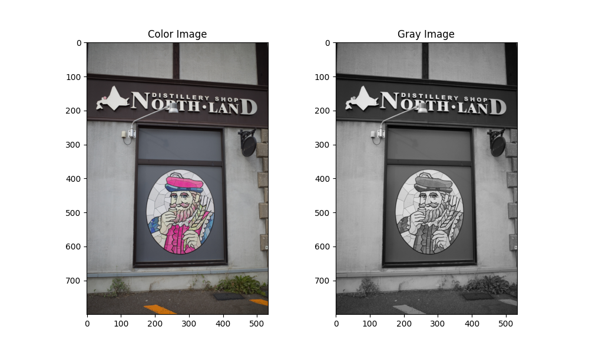
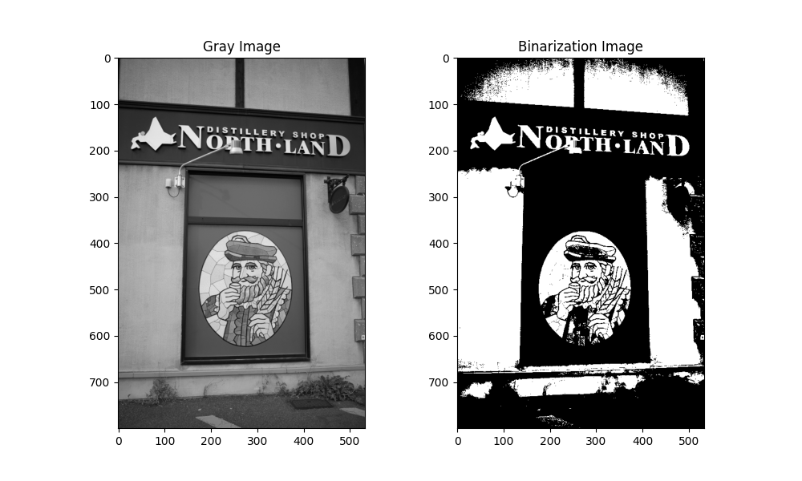
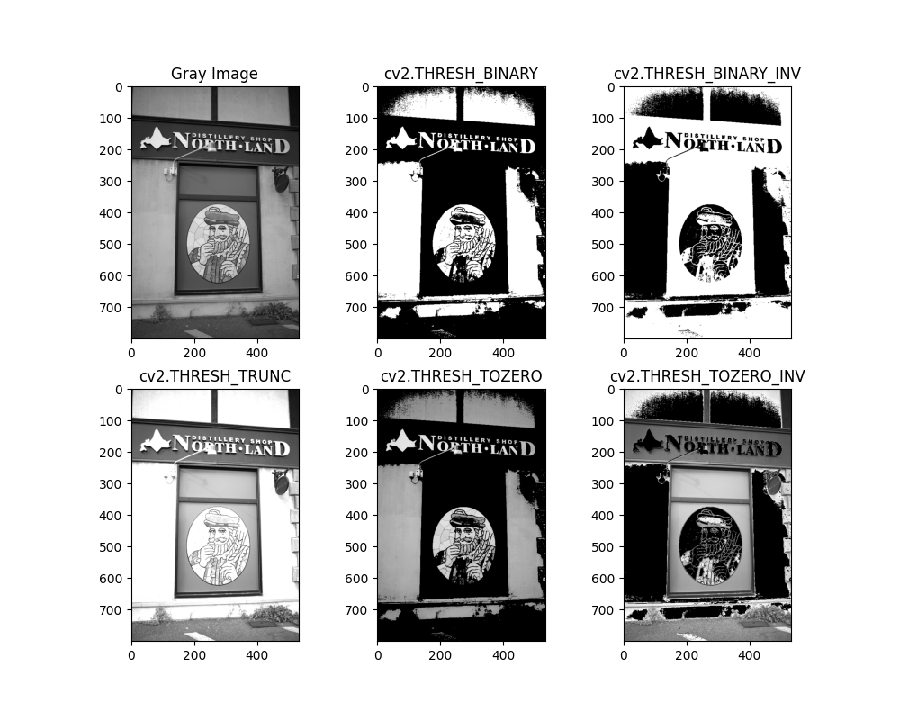
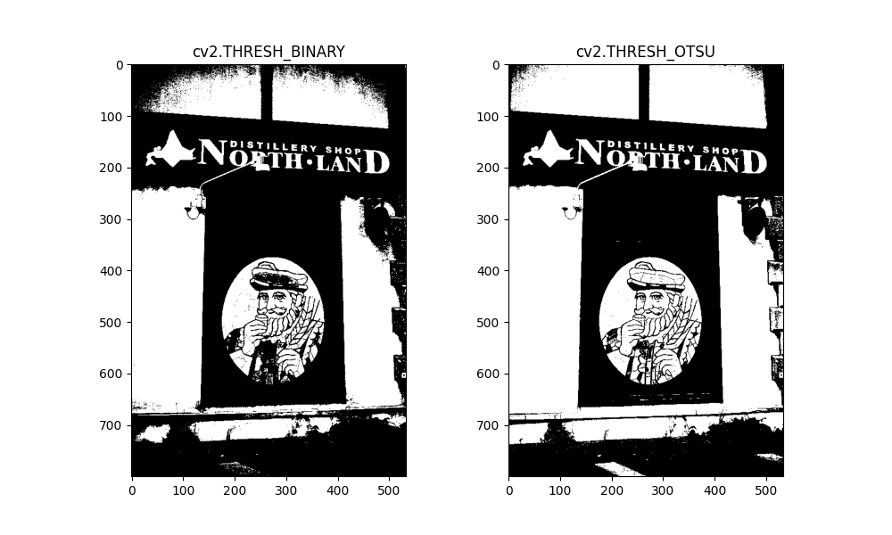
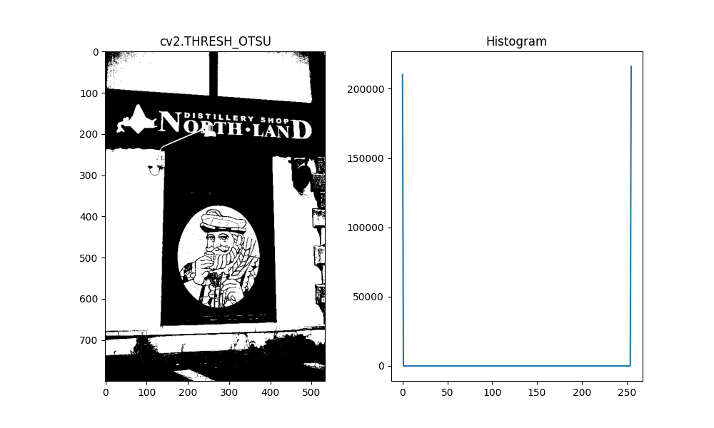
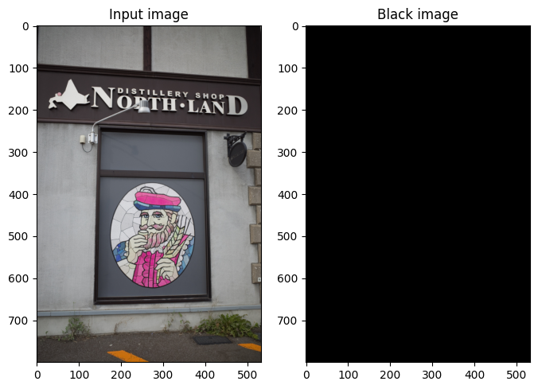
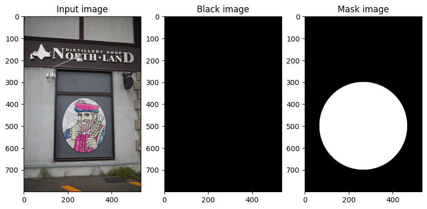
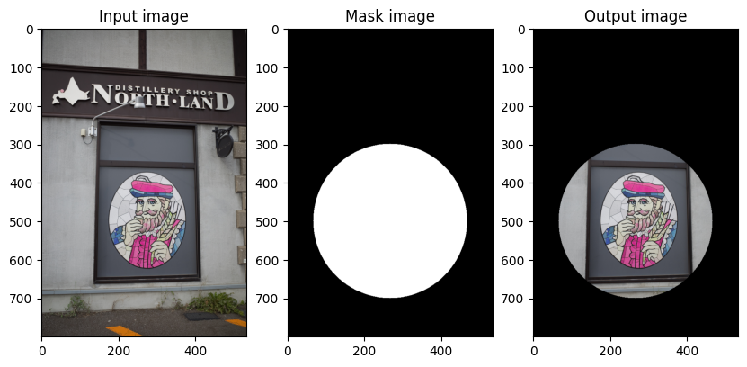

### 補足: matplotlibでグラフを並べる方法
- ``plt.figure(figsize=(A, B))``を使用することで，描画の大きさを設定できる
  - 横Aインチ，縦Bインチの意味
- ``plt.subplot()``を使用することで，一つの図の中にグラフを追加できる（流れは以下のとおり）
  1. ``plt.subplot()``で画像を描く場所を指定
  2. ``plt.imshow()``で画像を作成
  3. ``plt.subplot()``で画像を描く別の各場所を指定
  4. ``plt.imshow()``で画像を作成
  5. これを繰り返し，最後に``plt.show()``を行う
- ``plt.subplot(ABC)``と書く
  - ``A``, ``B``, ``C``: それぞれ一桁の正の整数
    - 図を縦にA個，横にB個に分割を行う
    - 左上から数えてC番目の領域を指定

- サンプルプログラム
```python
import cv2
import matplotlib.pyplot as plt
image = cv2.imread('nikka.jpeg')
imageA = cv2.cvtColor(image, cv2.COLOR_BGR2RGB)
imageB = cv2.cvtColor(image, cv2.COLOR_BGR2GRAY)

plt.figure(figsize=(10, 6)) # 横10インチ，縦6インチ

# 1つ目の描画
plt.subplot(121) # 縦1分割，横2分割の1番目に描画
plt.title('Color Image')
plt.imshow(imageA)

# 2つ目の描画
plt.subplot(122) # 縦1分割，横2分割の2番目に描画
plt.title('Gray Image')
plt.imshow(imageB)
plt.gray()

# 全体を表示
plt.show()
```

- 出力結果


### OpenCVによる二値化
- OpenCVをimportする: ``import cv2``
- ``cv2.threshold(画素値変数, しきい値，しきい値判断で変更する値，二値化の方法)``を使用することで，1行で実行できる
- 使用例（しきい値127を超えている画素を255にする）
  - ``変数1, 変数2 = cv2.threshold(画素値変数, 127, 255, cv2.THRESH_BINARY)``
  - この命令を実行すると，2値化を行い，2つのデータを変数で受け取れる
    - 変数1には二値化に使用したしきい値が代入
    - 変数2には二値化後の画像データが代入
- サンプルプログラム
```python
# サンプルプログラム
import cv2
import matplotlib.pyplot as plt
image = cv2.imread('nikka.jpeg')
image = cv2.cvtColor(image, cv2.COLOR_BGR2GRAY) # BGR → グレー

plt.figure(figsize=(10, 6)) # 横10インチ，縦6インチ

# 1つ目の描画
plt.subplot(121) # 縦1分割，横2分割の1番目に描画
plt.title('Gray Image')
plt.gray()
plt.imshow(image)

# 二値化を行う
threshold = 127 # しきい値
value, after_image = cv2.threshold(image, threshold, 255, cv2.THRESH_BINARY)
# 変数1のvalueにしきい値
# 変数2のafter_imageに二値化画像データ

print('しきい値:', value)

# 2つ目の描画
plt.subplot(122) # 縦1分割，横2分割の2番目に描画
plt.title('Binarization Image')
plt.gray()
plt.imshow(after_image)

# 全体を表示
plt.show()
```
- 出力結果


### 二値化方法
- ``cv2.threshold()``で使用できる二値化の方法は以下の通り
  - ``cv2.THRESH_BINARY``
    - 入力画像の画素値がしきい値より大きい場合はしきい値判断で変更する値，それ以外の場合は0にする
  - ``cv2.THRESH_BINARY_INV``
    - 入力画像の画素値がしきい値より大きい場合は0，それ以外の場合はしきい値判断で変更する値にする
  - ``cv2.THRESH_TRUNC``
    - 入力画像の画素値がしきい値より大きい場合はしきい値，それ以外の場合はそのままにする
  - ``cv2.THRESH_TOZERO``
    - 入力画像の画素値がしきい値より大きい場合はそのまま，それ以外の場合は0にする
  - ``cv2.THRESH_TOZERO_INV``
    - 入力画像の画素値がしきい値より大きい場合は0，それ以外の場合はそのままにする
  - ``cv2.THRESH_OTSU``
    - 大津の二値化を行う（しきい値は自動的に求まる）

- サンプルプログラム（各二値化の結果出力）

- 出力結果


- サンプルプログラム（大津の二値化）
```python
# 大津の二値化
import cv2
import matplotlib.pyplot as plt
image = cv2.imread('nikka.jpeg')
image = cv2.cvtColor(image, cv2.COLOR_BGR2GRAY)

plt.figure(figsize=(10, 6)) # 横10インチ，縦6インチ

# 1つ目の描画
# 二値化を行う
threshold = 127 # しきい値
value, after_image = cv2.threshold(image, threshold, 255, cv2.THRESH_BINARY)
plt.subplot(121) # 縦1分割，横2分割の1番目に描画
plt.title('cv2.THRESH_BINARY')
plt.imshow(after_image)
plt.gray()

# 2つ目の描画
# 二値化を行う
threshold = 127 # しきい値
value, after_image = cv2.threshold(image, threshold, 255, cv2.THRESH_OTSU)
print('大津の二値化のしきい値:', value)
plt.subplot(122) # 縦1分割，横2分割の2番目に描画
plt.title('cv2.THRESH_OTSU')
plt.imshow(after_image)
plt.gray()

# 全体を表示
plt.show()
```

- 出力結果


- サンプルプログラム（大津の二値化の画素値ヒストグラム）
```python


# 画素値ヒストグラムの出力

import cv2
import matplotlib.pyplot as plt
image = cv2.imread('nikka.jpeg')
image = cv2.cvtColor(image, cv2.COLOR_BGR2GRAY)

plt.figure(figsize=(10, 6)) # 横10インチ，縦6インチ

# 1つ目の描画
# 二値化を行う
threshold = 127 # しきい値
value, after_image = cv2.threshold(image, threshold, 255, cv2.THRESH_OTSU)
plt.subplot(121) # 縦1分割，横2分割の1番目に描画
plt.title('cv2.THRESH_OTSU')
plt.imshow(after_image)
plt.gray()

# 2つ目の描画
# ヒストグラム作成
plt.subplot(122) # 縦1分割，横2分割の2番目に描画
hist = cv2.calcHist([after_image], [0], None, [256], [0,256])
plt.title('Histogram')
plt.plot(hist)

# 全体を表示
plt.show()
```
- 出力結果



### マスク処理
- まず始めにマスク画像を用意するため，入力画像の解像度を知る必要がある
  - ``print(画像変数.shape)``とすることで，画像の解像度がわかる
  - カラー画像の場合: ``(縦のピクセル数, 横のピクセル数，3)``と出力する
    - 3は（R, G, B）の3種類を意味する
  - グレースケール画像の場合: ``(縦のピクセル数, 横のピクセル数)``と出力する
    - 縦のピクセル数は``画像変数.shape[0]``で取得できる
    - 横のピクセル数は``画像変数.shape[1]``で取得できる


- サンプルプログラム
```python
# カラー画像の場合
import cv2
image = cv2.imread('nikka.jpeg')
image = cv2.cvtColor(image, cv2.COLOR_BGR2RGB)
print(image.shape)
print(image.shape[0])
print(image.shape[1])
```

```python
# グレースケール画像の場合
import cv2
image = cv2.imread('nikka.jpeg')
image = cv2.cvtColor(image, cv2.COLOR_BGR2GRAY) # BGR → グレー
print(image.shape)
print(image.shape[0])
print(image.shape[1])
```

### マスク画像の作成
- 先程，取得した解像度情報を用いて，黒背景の長方形のファイルを用意する
  - ``np.full((縦のピクセル数, 横ピクセル数, 3), 0, np.uint8)``を使用することで，黒背景画像を生成できる

- サンプルプログラム
```python
import cv2
import numpy as np
import matplotlib.pyplot as plt
image = cv2.imread('nikka.jpeg')
image = cv2.cvtColor(image, cv2.COLOR_BGR2RGB)

# 2つ表示する
plt.figure(figsize=(8, 6)) # 横8インチ，縦6インチ

# 1つ目表示
plt.subplot(121) # 縦1分割，横2分割の1番目に描画
plt.title('Input image')
plt.imshow(image)

# 2つ目表示
height = image.shape[0] # 縦ピクセル数
width = image.shape[1] # 横ピクセル数
mask = np.full((height, width, 3), 0, np.uint8) # マスク画像の黒背景

plt.subplot(122) # 縦1分割，横2分割の2番目に描画
plt.title('Black image')
plt.imshow(mask)
plt.gray()

plt.show()
```
- 出力結果



### 白抜き部分を追加
- 長方形の白抜き
  - ``cv2.rectangle(マスク画像変数, (左上のx座標, 左上のy座標, 長方形の幅, 長方形の高さ), (255, 255, 255), -1)``
- 円の白抜き
  - ``cv2.circle(マスク画像変数, (中心のx座標, 中心のy座標), 半径, (255, 255, 255), -1)``

- サンプルプログラム
```python
import cv2
import numpy as np
import matplotlib.pyplot as plt
image = cv2.imread('nikka.jpeg')
image = cv2.cvtColor(image, cv2.COLOR_BGR2RGB)

# 3つ表示する
plt.figure(figsize=(10, 8)) # 横10インチ，縦8インチ

# 1つ目表示
plt.subplot(131) # 縦1分割，横3分割の1番目に描画
plt.title('Input image')
plt.imshow(image)

# 2つ目表示
height = image.shape[0] # 縦ピクセル数
width = image.shape[1] # 横ピクセル数
mask = np.full((height, width, 3), 0, np.uint8) # マスク画像の黒背景
plt.subplot(132) # 縦1分割，横3分割の2番目に描画
plt.title('Black image')
plt.imshow(mask)
plt.gray()

# 3つ目表示
plt.subplot(133) # 縦1分割，横3分割の3番目に描画
cv2.circle(mask, (width//2, height//2+100), 200, (255, 255, 255), -1) # 白抜き
plt.title('Mask image')
plt.imshow(mask)
plt.gray()

plt.show()
```
- 出力結果



### マスク処理の実行
- OpenCV機能を使って，以下のように書くことでマスク処理ができる
  - ``cv2.bitwise_and()``を使用する
    - 使用例: ``マスク処理結果変数 = cv2.bitwise_and(入力画像変数, マスク画像変数)``

- サンプルプログラム
```python
import cv2
import numpy as np
import matplotlib.pyplot as plt
image = cv2.imread('nikka.jpeg')
image = cv2.cvtColor(image, cv2.COLOR_BGR2RGB)

# 3つ表示する
plt.figure(figsize=(10, 8)) # 横10インチ，縦8インチ

# 1つ目表示
plt.subplot(131) # 縦1分割，横3分割の1番目に描画
plt.title('Input image')
plt.imshow(image)

# 2つ目表示
plt.subplot(132) # 縦1分割，横3分割の2番目に描画
height = image.shape[0] # 縦ピクセル数
width = image.shape[1] # 横ピクセル数
mask = np.full((height, width, 3), 0, np.uint8) # マスク画像の黒背景
cv2.circle(mask, (width//2, height//2+100), 200, (255, 255, 255), -1) # 白抜き
plt.title('Mask image')
plt.imshow(mask)
plt.gray()

# 3つ目表示
plt.subplot(133) # 縦1分割，横3分割の3番目に描画
after_image = cv2.bitwise_and(image, mask) # マスク処理を行う
plt.title('Output image')
plt.imshow(after_image)

plt.show()
```
- 出力結果

