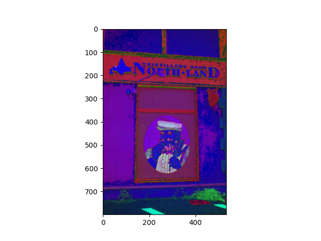
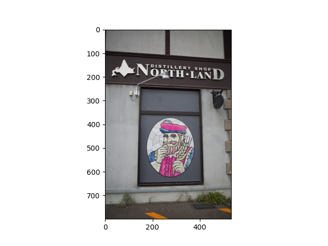
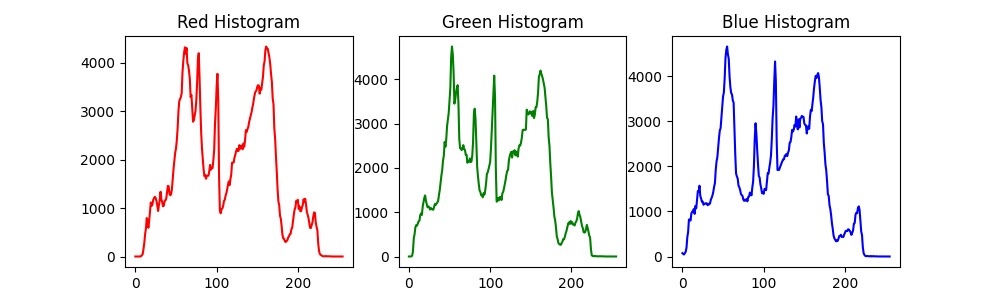
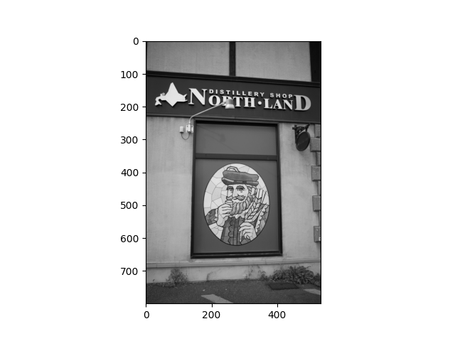
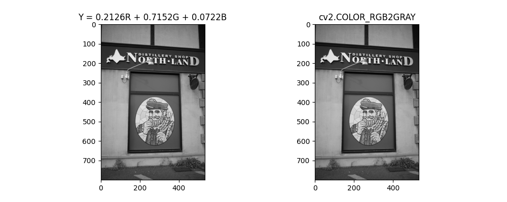
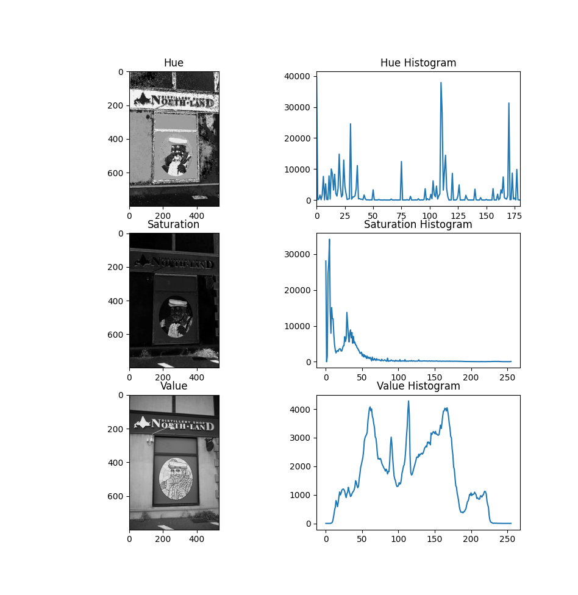
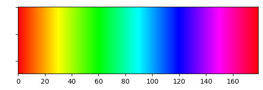

### 色空間
- OpenCVでは，RGB色空間からHSV色空間で色を扱うために，``cv2.cvtColor``を使用する
  - 使い方: ``変数名 = cv2.cvtColor(変数名, cv2.COLOR_BGR2HSV)``
  - ``cv2.COLOR_BGR2HSV``がBGRからHSVに変換する命令
  - ただし，``plt.imshow()``は**データをRGB形式であると判断して表示するため，表示する際はHSV形式をRGB形式に変換してから**``plt.imshow()``を行う

```python
# HSV形式はimshowで表示できない
import cv2
import matplotlib.pyplot as plt

image = cv2.imread('nikka.jpeg')
image = cv2.cvtColor(image, cv2.COLOR_BGR2HSV) # BGR → HSV
plt.imshow(image)
plt.show()
```
- 出力結果


```python
import cv2
import matplotlib.pyplot as plt
image = cv2.imread('nikka.jpeg')
image = cv2.cvtColor(image, cv2.COLOR_BGR2HSV) # BGR → HSV
image = cv2.cvtColor(image, cv2.COLOR_HSV2RGB) # HSV → RGB

plt.imshow(image)
plt.show()
```
- 出力結果



### RGB色空間
- OpenCVでは，RGBでデータを扱う場合，以下の方法でRGBの各値を取得できる
  - 赤画素値: ``RGB画像変数[:,:,0]``
  - 緑画素値: ``RGB画像変数[:,:,1]``
  - 青画素値: ``RGB画像変数[:,:,2]``

- サンプルプログラム
```python
import cv2
image = cv2.imread('nikka.jpeg')
image = cv2.cvtColor(image, cv2.COLOR_BGR2RGB) # BGR → RGB

red = image[:,:,0]
green = image[:,:,1]
blue = image[:,:,2]

print('red')
print(red)

print('green')
print(green)

print('blue')
print(blue)
```
- 出力結果
```
red
[[ 26  27  26 ...  20  34 160]
 [ 26  27  26 ...  23  33 155]
 [ 24  29  26 ...  24  31 153]
 ...
 [ 50  51  64 ...  57  54  55]
 [ 48  57  53 ...  56  53  55]
 [ 46  54  52 ...  56  52  51]]
green
[[ 20  21  20 ...  18  29 166]
 [ 20  21  20 ...  19  27 161]
 [ 20  20  20 ...  20  26 160]
 ...
 [ 46  47  60 ...  52  49  50]
 [ 42  53  49 ...  51  48  50]
 [ 42  50  51 ...  51  47  46]]
blue
[[ 20  23  20 ...  19  33 164]
 [ 20  21  20 ...  18  29 157]
 [ 21  21  22 ...  21  30 153]
 ...
 [ 45  44  57 ...  46  43  44]
 [ 42  50  48 ...  45  42  44]
 [ 39  47  49 ...  45  41  40]]
```

- サンプルプログラム
```python
import cv2
import matplotlib.pyplot as plt
image = cv2.imread('nikka.jpeg')
image = cv2.cvtColor(image, cv2.COLOR_BGR2RGB) # BGR → RGB

red = image[:,:,0]
green = image[:,:,1]
blue = image[:,:,2]

plt.figure(figsize=(10, 3)) # 横10インチ，縦3インチ

plt.subplot(131) # 縦1分割，横3分割の1番目に描画
red_hist = cv2.calcHist([red], [0], None, [256], [0,256])
plt.title('Red Histogram')
plt.plot(red_hist, color='r')

plt.subplot(132) # 縦1分割，横3分割の2番目に描画
green_hist = cv2.calcHist([green], [0], None, [256], [0,256])
plt.title('Green Histogram')
plt.plot(green_hist, color='g')

plt.subplot(133) # 縦1分割，横3分割の3番目に描画
blue_hist = cv2.calcHist([blue], [0], None, [256], [0,256])
plt.title('Blue Histogram')
plt.plot(blue_hist, color='b')

plt.show()
```
- 出力結果


- RGBからグレースケールの式は，``Y = 0.2126R + 0.7152G + 0.0722B``であるため，
  - ``グレースケール画素値変数 = 0.2126 * 赤画素値変数 + 0.7152 * 緑画素値変数 + 0.0722 * 青画素値変数``というプログラムはグレースケースへ変換を意味する

- サンプルプログラム
```python
import cv2
import matplotlib.pyplot as plt
image = cv2.imread('nikka.jpeg')
image = cv2.cvtColor(image, cv2.COLOR_BGR2RGB) # BGR → RGB

red = image[:,:,0]
green = image[:,:,1]
blue = image[:,:,2]

Y = 0.2126 * red + 0.7152 * green + 0.0722 * blue

plt.imshow(Y)
plt.gray()
plt.show()
```
- 出力結果


- サンプルプログラム
```python
import cv2
import matplotlib.pyplot as plt
image = cv2.imread('nikka.jpeg')
image = cv2.cvtColor(image, cv2.COLOR_BGR2RGB) # BGR → RGB

red = image[:,:,0]
green = image[:,:,1]
blue = image[:,:,2]
Y = 0.2126 * red + 0.7152 * green + 0.0722 * blue

after_image = cv2.cvtColor(image, cv2.COLOR_RGB2GRAY)

plt.figure(figsize=(10, 4)) # 横10インチ，縦4インチ

plt.subplot(121) # 縦1分割，横2分割の1番目に描画
plt.title('Y = 0.2126R + 0.7152G + 0.0722B')
plt.gray()
plt.imshow(Y)

plt.subplot(122) # 縦1分割，横2分割の2番目に描画
plt.title('cv2.COLOR_RGB2GRAY')
plt.gray()
plt.imshow(after_image)

plt.show()
```
- 出力結果


### BGR色空間
- OpenCVでは，BGRでデータを扱う場合，以下の方法でRGBの各値を取得できる
  - 赤画素値: ``BGR画像変数[:,:,2]``
  - 緑画素値: ``BGR画像変数[:,:,1]``
  - 青画素値: ``BGR画像変数[:,:,0]``

- サンプルプログラム
```python
import cv2
import matplotlib.pyplot as plt
image = cv2.imread('nikka.jpeg')

# BGR形式なので
red = image[:,:,2]
green = image[:,:,1]
blue = image[:,:,0]

plt.figure(figsize=(10, 3)) # 横10インチ，縦3インチ

plt.subplot(131) # 縦1分割，横3分割の1番目に描画
red_hist = cv2.calcHist([red], [0], None, [256], [0,256])
plt.title('Red Histogram')
plt.plot(red_hist, color='r')

plt.subplot(132) # 縦1分割，横3分割の2番目に描画
green_hist = cv2.calcHist([green], [0], None, [256], [0,256])
plt.title('Green Histogram')
plt.plot(green_hist, color='g')

plt.subplot(133) # 縦1分割，横3分割の3番目に描画
blue_hist = cv2.calcHist([blue], [0], None, [256], [0,256])
plt.title('Blue Histogram')
plt.plot(blue_hist, color='b')

plt.show()
```
- 出力結果


### HSV色空間
- OpenCVでは，HSVでデータを扱う場合，以下の方法でHSVの各値を取得できる
  - 色彩(H): ``HSV画像変数[:,:,0]``
  - 彩度(S): ``HSV画像変数[:,:,1]``
  - 明度(V): ``HSV画像変数[:,:,2]``
- ただし，opencvで色彩(H)を0〜180で扱うため注意が必要

```python
import cv2
image = cv2.imread('nikka.jpeg')
image = cv2.cvtColor(image, cv2.COLOR_BGR2HSV) # BGR → HSV

# HSV形式なので
hue = image[:,:,0]
saturation = image[:,:,1]
value = image[:,:,2]

print('hue')
print(hue)

print('saturation')
print(saturation)

print('value')
print(value)
```

- 出力結果
```
hue
[[  0 170   0 ... 165 156  80]
 [  0   0   0 ...   6 170  70]
 [173 177 170 ... 173 156  60]
 ...
 [  6  13  13 ...  16  16  16]
 [  0  13   6 ...  16  16  16]
 [ 13  13  20 ...  16  16  16]]
saturation
[[59 57 59 ... 26 38  9]
 [59 57 59 ... 55 46 10]
 [43 79 59 ... 43 41 11]
 ...
 [26 35 28 ... 49 52 51]
 [32 31 24 ... 50 53 51]
 [39 33 15 ... 50 54 55]]
value
[[ 26  27  26 ...  20  34 166]
 [ 26  27  26 ...  23  33 161]
 [ 24  29  26 ...  24  31 160]
 ...
 [ 50  51  64 ...  57  54  55]
 [ 48  57  53 ...  56  53  55]
 [ 46  54  52 ...  56  52  51]]
```

- サンプルプログラム
```python
import cv2
import matplotlib.pyplot as plt
image = cv2.imread('nikka.jpeg')
image = cv2.cvtColor(image, cv2.COLOR_BGR2HSV) # BGR → HSV

# HSV形式なので
hue = image[:,:,0]
saturation = image[:,:,1]
value = image[:,:,2]

plt.figure(figsize=(8, 12)) # 横8インチ，縦12インチ
plt.subplot(321)
plt.title('Hue')
plt.gray()
plt.imshow(hue)

plt.subplot(322)
hue_hist = cv2.calcHist([hue], [0], None, [256], [0,256])
plt.xlim(0, 180)
plt.title('Hue Histogram')
plt.plot(hue_hist)

plt.subplot(323)
plt.title('Saturation')
plt.gray()
plt.imshow(saturation)

plt.subplot(324)
saturation_hist = cv2.calcHist([saturation], [0], None, [256], [0,256])
plt.title('Saturation Histogram')
plt.plot(saturation_hist)

plt.subplot(325)
plt.title('Value')
plt.gray()
plt.imshow(value)

plt.subplot(326)
value_hist = cv2.calcHist([value], [0], None, [256], [0,256])
plt.title('Value Histogram')
plt.plot(value_hist)

plt.show()
```
- 出力結果


### HSV色空間
- HSV色空間は色彩が0から360の値になるので，色彩の値を絞りこむことで特定の色を抽出できる
  - 色彩の代表値
    - 0付近: 赤色
    - 60付近: 黄色
    - 120付近: 緑色
    - 180付近: シアン色
    - 240付近: 青色
    - 300付近: マゼンタ色
  - ただし，**opencvでは，色彩は以下のように扱う（値が半分になる）**
    - 0付近: 赤色
    - 30付近: 黄色
    - 60付近: 緑色
    - 90付近: シアン色
    - 120付近: 青色
    - 150付近: マゼンタ色
- 色彩目安


### HSVを使用したマスク画像の作成
- OpenCVの``cv2.inRange``を使用することで，HSVの要素によるマスク画像を作成できる
  - ``hsv下限の値変数 = np.array([色彩の下限値, 彩度の下限値, 明度の下限値], np.uint8)``
  - ``hsv上限の値変数 = np.array([色彩の上限値, 彩度の上限値, 明度の上限値], np.uint8)``
  - ``マスク画像変数 = cv2.inRange(HSV画像変数, hsv下限の値変数, hsv上限の値変数)``
   
- 以下の画像（color-sample.png）を使用して，特定の色だけを抜き出すプログラムを考える

- サンプルプログラム
```python
# color-sample.pngおよびHの調査
import cv2
import matplotlib.pyplot as plt

image = cv2.imread('color-sample.png')
image = cv2.cvtColor(image, cv2.COLOR_BGR2RGB) # BGR → RGB

plt.figure(figsize=(10, 4)) # 横10インチ，縦4インチ
plt.subplot(121)
plt.title('Image')
plt.imshow(image)

image = cv2.cvtColor(image, cv2.COLOR_RGB2HSV) # BGR → HSV
hue = image[:,:,0]
plt.subplot(122)
hue_hist = cv2.calcHist([hue], [0], None, [256], [0,256])
plt.xlim(0, 180)
plt.title('Hue Histogram')
plt.plot(hue_hist)

plt.show()
```

- hueのヒストグラムで，山があるところが色相がある部分である

```python
# 黄色だけ抜き出すマスクを作成する
import cv2
import numpy as np
import matplotlib.pyplot as plt
image = cv2.imread('color-sample.png')
image = cv2.cvtColor(image, cv2.COLOR_BGR2HSV) # BGR → HSV

# 黄色はhueのヒストグラムで30付近なので（数値は手作業で求める）
min = np.array([25, 50, 50], np.uint8)
max = np.array([35, 255, 255], np.uint8)
mask = cv2.inRange(image, min, max)

plt.imshow(mask)
plt.gray() # マスク画像は白黒画像なので
plt.show()
```

- このHSVによるマスク処理は，以下のプログラムで行う（**前回行った内容ではエラーになるので注意**）
  1. ``RGB画像変数 = cv2.cvtColor(HSV画像変数, cv2.COLOR_HSV2RGB)``
  2. ``マスク処理後画像変数 = cv2.bitwise_and(RGB画像変数, RGB画像変数, mask=マスク画像変数)``

```python
# 黄色だけ抜き出すマスクを作成し適用する
import cv2
import numpy as np
import matplotlib.pyplot as plt
image = cv2.imread('color-sample.png')
image = cv2.cvtColor(image, cv2.COLOR_BGR2HSV) # BGR → HSV

# 黄色はhueのヒストグラムで30付近なので（数値は手作業で求める）
min = np.array([25, 50, 50], np.uint8)
max = np.array([35, 255, 255], np.uint8)
mask = cv2.inRange(image, min, max)

# HSVをRGBに戻す処理を行う
image = cv2.cvtColor(image, cv2.COLOR_HSV2RGB)

# マスク処理を行う
after_image = cv2.bitwise_and(image, image, mask=mask)

plt.imshow(after_image)
plt.show()
```

```python
import cv2
import numpy as np
import matplotlib.pyplot as plt
image = cv2.imread('color-sample.png')
image = cv2.cvtColor(image, cv2.COLOR_BGR2HSV) # BGR → HSV

# # 黄色はhueのヒストグラムで30付近なので（数値は手作業で求める）
min = np.array([25, 50, 50], np.uint8)
max = np.array([35, 255, 255], np.uint8)
mask = cv2.inRange(image, min, max)

# HSVをRGBに戻す処理を行う
image = cv2.cvtColor(image, cv2.COLOR_HSV2RGB)

# マスク処理を行う
after_image = cv2.bitwise_and(image, image, mask=mask)

plt.figure(figsize=(12, 8)) # 横12インチ，縦8インチ

# 1つ目表示
plt.subplot(131) # 縦1分割，横3分割の1番目に描画
plt.title('Input image')
plt.imshow(image)

# 2つ目表示
plt.subplot(132) # 縦1分割，横3分割の2番目に描画
plt.title('Mask image')
plt.imshow(mask)
plt.gray()

# 3つ目表示
plt.subplot(133) # 縦1分割，横3分割の3番目に描画
plt.title('Output image')
plt.imshow(after_image)

plt.show()
```


- 色彩が連続してる色を抽出する場合，``cv2.inRange``の幅を広くすれば複数の色を抽出できる
```python
# 黄色とオレンジだけ抜き出すマスクを作成する
import cv2
import numpy as np
import matplotlib.pyplot as plt
image = cv2.imread('color-sample.png')
image = cv2.cvtColor(image, cv2.COLOR_BGR2HSV) # BGR → HSV

# オレンジと黄色は連続している色彩なので，
# オレンジと黄色の色彩付近の色を範囲指定する
min = np.array([10, 50, 50], np.uint8)
max = np.array([35, 255, 255], np.uint8)
mask = cv2.inRange(image, min, max)

# HSVをRGBに戻す処理を行う
image = cv2.cvtColor(image, cv2.COLOR_HSV2RGB)

# マスク処理を行う
after_image = cv2.bitwise_and(image, image, mask=mask)

plt.imshow(after_image)
plt.show()
```


- 色彩が連続していない色を抽出する場合，マスク画像を組み合わせることで，複数の色を抽出できる
- maskの組み合わせ: ``全体のマスク変数 = cv2.bitwise_or(マスク変数1, マスク変数2)``
```python
# 黄色と青色だけ抜き出すマスクを作成する
import cv2
import numpy as np
import matplotlib.pyplot as plt
image = cv2.imread('color-sample.png')
image = cv2.cvtColor(image, cv2.COLOR_BGR2HSV) # BGR → HSV

# 黄色と青色は連続していない色彩なので，
# まず始めに，黄色を抜き出すマスクを作成する
min = np.array([25, 50, 50], np.uint8)
max = np.array([35, 255, 255], np.uint8)
mask1 = cv2.inRange(image, min, max)

# 次に，青色を抜き出すマスクを作成する
min = np.array([115, 50, 50], np.uint8)
max = np.array([125, 255, 255], np.uint8)
mask2 = cv2.inRange(image, min, max)

# maskの統合
mask = cv2.bitwise_or(mask1, mask2)

# マスク処理を行う
image = cv2.cvtColor(image, cv2.COLOR_HSV2RGB)
after_image = cv2.bitwise_and(image, image, mask=mask)

plt.imshow(after_image)
plt.show()
```

- 赤付近を抜き出す場合は，0付近であるので，0〜5, 175〜179ぐらいで抜き出す
```python
# 赤色を抜き出すマスクを作成する
import cv2
import numpy as np
import matplotlib.pyplot as plt
image = cv2.imread('color-sample.png')
image = cv2.cvtColor(image, cv2.COLOR_BGR2HSV) # BGR → HSV

# まず始めに，色彩0から5を抜き出すマスクを作成する
min = np.array([0, 50, 50], np.uint8)
max = np.array([5, 255, 255], np.uint8)
mask1 = cv2.inRange(image, min, max)

# 次に，175から179をを抜き出すマスクを作成する
min = np.array([175, 50, 50], np.uint8)
max = np.array([179, 255, 255], np.uint8)
mask2 = cv2.inRange(image, min, max)

# maskの統合
mask = cv2.bitwise_or(mask1, mask2)

# マスク処理を行う
image = cv2.cvtColor(image, cv2.COLOR_HSV2RGB)
after_image = cv2.bitwise_and(image, image, mask=mask)

plt.imshow(after_image)
plt.show()
```

- マスクを色々と組み合わせることで，特定の複数色を抜き出すことができる
```python
# 赤色と黄色と青色を抜き出すマスクを作成する
import cv2
import numpy as np
import matplotlib.pyplot as plt
image = cv2.imread('color-sample.png')
image = cv2.cvtColor(image, cv2.COLOR_BGR2HSV) # BGR → HSV

# まず始めに，赤色の色彩0から5を抜き出すマスクを作成する
min = np.array([0, 50, 50], np.uint8)
max = np.array([5, 255, 255], np.uint8)
mask1 = cv2.inRange(image, min, max)

# 次に，赤色の175から179をを抜き出すマスクを作成する
min = np.array([175, 50, 50], np.uint8)
max = np.array([179, 255, 255], np.uint8)
mask2 = cv2.inRange(image, min, max)

# 次に，黄色の25から35をを抜き出すマスクを作成する
min = np.array([25, 50, 50], np.uint8)
max = np.array([35, 255, 255], np.uint8)
mask3 = cv2.inRange(image, min, max)

# 最後に，青色の115から125をを抜き出すマスクを作成する
min = np.array([115, 50, 50], np.uint8)
max = np.array([125, 255, 255], np.uint8)
mask4 = cv2.inRange(image, min, max)

# maskの統合
mask = cv2.bitwise_or(mask1, mask2)
mask = cv2.bitwise_or(mask, mask3)
mask = cv2.bitwise_or(mask, mask4)

# マスク処理を行う
image = cv2.cvtColor(image, cv2.COLOR_HSV2RGB)
after_image = cv2.bitwise_and(image, image, mask=mask)

plt.imshow(after_image)
plt.show()
```

### RGBA画像の読み込み
- OpenCVでRGBA画像を読み込む場合，``cv2.imread(画像ファイル名, -1)``と書く
- BGRAの順番で読み込むため，``cv2.COLOR_BGRA2RGBA``を使用して，RGBAの順番に変換して表示する

- サンプル画像（rgba-sample.png）
```python
import cv2
import matplotlib.pyplot as plt

# RGBA画像の読み込み
image = cv2.imread('rgba-sample.png', -1)
# BGRA → RGBA
image = cv2.cvtColor(image, cv2.COLOR_BGRA2RGBA)
# 画像の表示
plt.imshow(image)
plt.show()
```

### RGBA色空間
- OpenCVでは，RGBAでデータを扱う場合，以下の方法でRGBAの各値を取得できる
  - 赤画素値: RGBA画像変数[:,:,0]
  - 緑画素値: RGBA画像変数[:,:,1]
  - 青画素値: RGBA画像変数[:,:,2]
  - 透過度: RGBA画像変数[:,:,3]
    - **透過度は0から255の値で扱うため，0が透明，255が不透明になる**
      - グレースケールで表示すると，255（白の箇所: 不透明箇所）が0（黒の箇所: 透明箇所）となる
      - 白に近い灰色は透過度が高く不透明，黒に近い灰色は透過度が低く透明になる

```python
import cv2
import matplotlib.pyplot as plt

image = cv2.imread('rgba-sample.png', -1) # 透過付き画像の読み込み
image = cv2.cvtColor(image, cv2.COLOR_BGRA2RGBA) # BGRA → RGBA

# 透過度を抜き出す
alpha = image[:,:,3]

plt.imshow(alpha)
plt.gray()
plt.show()
```

```python
import cv2
import matplotlib.pyplot as plt

image = cv2.imread('rgba-sample.png', -1) # 透過付き画像の読み込み
image = cv2.cvtColor(image, cv2.COLOR_BGRA2RGBA) # BGRA → RGBA

# RGBA形式なので
red = image[:,:,0]
green = image[:,:,1]
blue = image[:,:,2]
alpha = image[:,:,3]

plt.figure(figsize=(10, 16)) # 横10インチ，縦16インチ
plt.subplot(421)
plt.title('Red')
plt.gray()
plt.imshow(red)

plt.subplot(422)
red_hist = cv2.calcHist([red], [0], None, [256], [0,256])
plt.title('Red Histogram')
plt.plot(red_hist, color='r')

plt.subplot(423)
plt.title('Green')
plt.gray()
plt.imshow(green)

plt.subplot(424)
green_hist = cv2.calcHist([green], [0], None, [256], [0,256])
plt.title('Green Histogram')
plt.plot(green_hist, color='g')

plt.subplot(425)
plt.title('Blue')
plt.gray()
plt.imshow(blue)

plt.subplot(426)
blue_hist = cv2.calcHist([blue], [0], None, [256], [0,256])
plt.title('Blue Histogram')
plt.plot(blue_hist, color='b')

plt.subplot(427)
plt.title('Alpha')
plt.gray()
plt.imshow(alpha)

plt.subplot(428)
alpha_hist = cv2.calcHist([alpha], [0], None, [256], [0,256])
plt.title('Alpha Histogram')
plt.plot(alpha_hist, color='k')

plt.show()
```

### 2画像の組み合わせ
- 組み合わせたい2つの画像を用意する
  - **ただし，画像のサイズを合わせる必要がある**

- 使用画像
  - 画像ファイル1（blend-a-1.png）
  - 画像ファイル2（blend-a-2.png）


### 画像サイズの確認
- 画像サイズを確認する場合，``print(画像ファイル変数.shape)``を使用する
- ``画像ファイル変数1.shape == 画像ファイル変数2.shape``と実行し，**``True``が表示した場合，同じ大きさの画像であることがわかる**
  - ``==``は等しい という意味で使用される
    - ``True``が表示された場合: 『左辺と右辺は等しい』という意味になる
    - ``False``が表示された場合: 『左辺と右辺は等しくない』という意味になる

```python
import cv2
image1 = cv2.imread('blend-a-1.png', -1)
image2 = cv2.imread('blend-a-2.png', -1)
image3 = cv2.imread('nikka.jpeg')

print(image1.shape)
print(image2.shape)
print(image3.shape)

print(image1.shape == image2.shape)
print(image1.shape == image3.shape)
print(image2.shape == image3.shape)
```

### 画素値の組み合わせ
- 2画像の画素をただ組み合わせる場合，以下のプログラムで実装できる
  - ``組み合わせた画像変数 = 画像1変数 + 画像変数2``

```python
import cv2
import matplotlib.pyplot as plt

image1 = cv2.imread('blend-a-1.png', -1)
image2 = cv2.imread('blend-a-2.png', -1)

# サイズチェック
print(image1.shape == image2.shape)

# BGRA → RGBA
image1 = cv2.cvtColor(image1, cv2.COLOR_BGRA2RGBA)
image2 = cv2.cvtColor(image2, cv2.COLOR_BGRA2RGBA)

# 画素値の足し合わせ
blend_image = image1 + image2

plt.imshow(blend_image)
plt.show()
```

### 平均値画像の実装
- 2画像の画素の平均値の画素を求める場合，以下のプログラムで実装できる  
  - ``組み合わせた画像変数 = (画像1変数 + 画像変数2) // 2``
 
```python
import cv2
import matplotlib.pyplot as plt

image1 = cv2.imread('blend-a-1.png', -1)
image2 = cv2.imread('blend-a-2.png', -1)

# サイズチェック
print(image1.shape == image2.shape)

# BGRA → RGBA
image1 = cv2.cvtColor(image1, cv2.COLOR_BGRA2RGBA)
image2 = cv2.cvtColor(image2, cv2.COLOR_BGRA2RGBA)

# 平均値画素を求める
blend = (image1 + image2) // 2

plt.imshow(blend)
plt.show()
```

### アルファブレンディングの実装
- 使用画像（https://www.beiz.jp/ からフリー画像を拝借）
  - 画像ファイル1（blend-b-1.jpg）
  - 画像ファイル1（blend-b-2.jpg）

- 数式: ``出力画像画素値 = α × 入力画像1画素値 + β × 入力画像2画素値 + γ``で計算する
- プログラムの実装: ``cv2.addWeighted``を使用する
  - ``アルファブレンディング画像 = cv2.addWeighted(画像1変数, αの値, 画像2変数, βの値, γの値)``
    - **``β``の値を``1-α``，``γ``の値を``0``にすれば，アルファブレンディングになる**
- 実装例
```python
alpha = 0.5 # αの値
アルファブレンディング画像 = cv2.addWeighted(画像1変数, alpha, 画像2変数, 1 - alpha, 0)
```

- サンプルプログラム（α=0.5でアルファブレンディング）
```python
import cv2
import matplotlib.pyplot as plt

image1 = cv2.imread('blend-b-1.jpg')
image2 = cv2.imread('blend-b-2.jpg')

# サイズチェック
print(image1.shape == image2.shape)

# BGR → RGB
image1 = cv2.cvtColor(image1, cv2.COLOR_BGR2RGB)
image2 = cv2.cvtColor(image2, cv2.COLOR_BGR2RGB)

# アルファブレンディング
alpha = 0.5
blend_image = cv2.addWeighted(image1, alpha, image2, 1 - alpha, 0)
plt.imshow(blend_image)
plt.show()
```

- サンプルプログラム
```python
import cv2
import matplotlib.pyplot as plt

image1 = cv2.imread('blend-b-1.jpg')
image2 = cv2.imread('blend-b-2.jpg')

# サイズチェック
print(image1.shape == image2.shape)

# BGR → RGB
image1 = cv2.cvtColor(image1, cv2.COLOR_BGR2RGB)
image2 = cv2.cvtColor(image2, cv2.COLOR_BGR2RGB)

plt.figure(figsize=(12, 6)) # 横12インチ，縦6インチ

alpha = 0.2
blend_image = cv2.addWeighted(image1, alpha, image2, 1 - alpha, 0)
plt.subplot(131)
plt.title('alpha=0.2')
plt.imshow(blend_image)

alpha = 0.5
blend_image = cv2.addWeighted(image1, alpha, image2, 1 - alpha, 0)
plt.subplot(132)
plt.title('alpha=0.5')
plt.imshow(blend_image)

alpha = 0.8
blend_image = cv2.addWeighted(image1, alpha, image2, 1 - alpha, 0)
plt.subplot(133)
plt.title('alpha=0.8')
plt.imshow(blend_image)

plt.show()
```

### クロマキー合成の実装
- 使用画像（https://tinyurl.com/2d6hu7y5 から動画を拝借）
  - 入力ファイル1（green_cat.jpg）
  - 入力ファイル2（boston.jpeg）

##### 実装方法
- Step1: グリーンバックの切り抜きを作り，マスク画像を作成する
  - ``cv2.bitwise_not(入力画像)``を使用することで，**黒と白が反転(255 - 画素値)する**
    - 黒が白になる
    - 白が黒になる

```python
import cv2
import numpy as np
import matplotlib.pyplot as plt

image1 = cv2.imread('green_cat.jpg')

# BGR → HSV
image1 = cv2.cvtColor(image1, cv2.COLOR_BGR2HSV)

# 緑色を抜き出すマスクを作る（数値は手作業で求める）
min = np.array([20, 50, 50], np.uint8)
max = np.array([80, 255, 255], np.uint8)
# 緑色を白，それ以外を黒にする
mask1 = cv2.inRange(image1, min, max)
# 白黒反転
mask2 = cv2.bitwise_not(mask1)

plt.figure(figsize=(12, 6)) # 横12インチ，縦6インチ
image1 = cv2.cvtColor(image1, cv2.COLOR_HSV2RGB)
plt.subplot(131)
plt.title('input')
plt.imshow(image1)

plt.subplot(132)
plt.title('mask1')
plt.gray()
plt.imshow(mask1)

plt.subplot(133)
plt.title('mask2')
plt.gray()
plt.imshow(mask2)

plt.show()
```

- Step2: 入力ファイル1とmask2のマスク合成，入力ファイル2とmask1のマスク合成を行う
```python
import cv2
import numpy as np
import matplotlib.pyplot as plt

image1 = cv2.imread('green_cat.jpg')
image2 = cv2.imread('boston.jpeg')

# BGR → HSV
image1 = cv2.cvtColor(image1, cv2.COLOR_BGR2HSV)
# BGR → RGB
image2 = cv2.cvtColor(image2, cv2.COLOR_BGR2RGB)

# 緑色を抜き出すマスクを作る（数値は手作業で求める）
min = np.array([20, 50, 50], np.uint8)
max = np.array([80, 255, 255], np.uint8)

# 緑色を白，それ以外を黒にする
mask1 = cv2.inRange(image1, min, max)

# 白黒反転
mask2 = cv2.bitwise_not(mask1)

# HSVをRGBに戻す処理を行う
image1 = cv2.cvtColor(image1, cv2.COLOR_HSV2RGB)

# マスク処理を行う
after_image1 = cv2.bitwise_and(image1, image1, mask=mask2)
after_image2 = cv2.bitwise_and(image2, image2, mask=mask1)

plt.figure(figsize=(12, 6)) # 横12インチ，縦6インチ
plt.subplot(121)
plt.title('blend1')
plt.imshow(after_image1)

plt.subplot(122)
plt.title('blend2')
plt.imshow(after_image2)

plt.show()
```

- Step3: Step2で求めた2つのマスク合成画像を組み合わせて，クロマキー合成画像を得る
  - ``クロマキー合成変数 = マスク合成画像1変数 + マスク合成画像2変数``


- サンプルプログラム（Step1から3をまとめたもの）
```python
import cv2
import numpy as np
import matplotlib.pyplot as plt

image1 = cv2.imread('green_cat.jpg')
image2 = cv2.imread('boston.jpeg')

# BGR → HSV
image1 = cv2.cvtColor(image1, cv2.COLOR_BGR2HSV)
# BGR → RGB
image2 = cv2.cvtColor(image2, cv2.COLOR_BGR2RGB)

# Step1: 緑色を抜き出すマスクを作る（数値は手作業で求める）
min = np.array([20, 50, 50], np.uint8)
max = np.array([80, 255, 255], np.uint8)

# 緑色を白，それ以外を黒にする
mask1 = cv2.inRange(image1, min, max)

# 白黒反転
mask2 = cv2.bitwise_not(mask1)

# HSVをRGBに戻す処理を行う
image1 = cv2.cvtColor(image1, cv2.COLOR_HSV2RGB)

# Step2: マスク処理を行う
after_image1 = cv2.bitwise_and(image1, image1, mask=mask2)
after_image2 = cv2.bitwise_and(image2, image2, mask=mask1)

# Step3: クロマキー合成を作る
after_image3 = after_image1 + after_image2

plt.figure(figsize=(12, 6)) # 横12インチ，縦6インチ
plt.subplot(131)
plt.title('blend1')
plt.imshow(after_image1)

plt.subplot(132)
plt.title('blend2')
plt.imshow(after_image2)

plt.subplot(133)
plt.title('Chroma key')
plt.imshow(after_image3)

plt.show()
```
