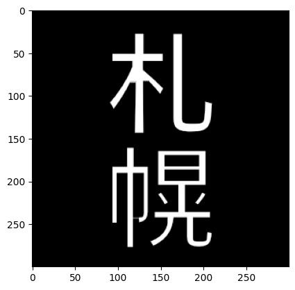

### モルフォロジー演算

- 以下の二値化画像（``wb.jpg``）を使用して，説明を行う


- 代表的なカーネルを作成: ``cv2.getStructuringElement()``を使用する
  - ``cv2.getStructuringElement(cv2.MORPH_RECT,(n, n))``: n × nの矩形（正方形）のカーネルの作成
  - ``cv2.getStructuringElement(cv2.MORPH_CROSS,(n, n))``: n × nの十字のカーネルの作成
    - **``cv2.MORPH_RECT``か``cv2.MORPH_CROSS``と``n``を指定すればよい**
  - **フィルタリング対象領域を1となる**

- サンプルプログラム（カーネルの表示）
```python
import cv2

# 矩形カーネル
print('3×3 矩形カーネル')
print(cv2.getStructuringElement(cv2.MORPH_RECT,(3, 3)))
print('5×5 矩形カーネル')
print(cv2.getStructuringElement(cv2.MORPH_RECT,(5, 5)))
print('7×7 矩形カーネル')
print(cv2.getStructuringElement(cv2.MORPH_RECT,(7, 7)))

# 十字カーネル
print('3×3 十字カーネル')
print(cv2.getStructuringElement(cv2.MORPH_CROSS,(3, 3)))
print('5×5 十字カーネル')
print(cv2.getStructuringElement(cv2.MORPH_CROSS,(5, 5)))
print('7×7 十字カーネル')
print(cv2.getStructuringElement(cv2.MORPH_CROSS,(7, 7)))

# フィルタリング対象領域を1で表示する
```
- 出力結果
```
3×3 矩形カーネル
[[1 1 1]
 [1 1 1]
 [1 1 1]]
5×5 矩形カーネル
[[1 1 1 1 1]
 [1 1 1 1 1]
 [1 1 1 1 1]
 [1 1 1 1 1]
 [1 1 1 1 1]]
7×7 矩形カーネル
[[1 1 1 1 1 1 1]
 [1 1 1 1 1 1 1]
 [1 1 1 1 1 1 1]
 [1 1 1 1 1 1 1]
 [1 1 1 1 1 1 1]
 [1 1 1 1 1 1 1]
 [1 1 1 1 1 1 1]]
3×3 十字カーネル
[[0 1 0]
 [1 1 1]
 [0 1 0]]
5×5 十字カーネル
[[0 0 1 0 0]
 [0 0 1 0 0]
 [1 1 1 1 1]
 [0 0 1 0 0]
 [0 0 1 0 0]]
7×7 十字カーネル
[[0 0 0 1 0 0 0]
 [0 0 0 1 0 0 0]
 [0 0 0 1 0 0 0]
 [1 1 1 1 1 1 1]
 [0 0 0 1 0 0 0]
 [0 0 0 1 0 0 0]
 [0 0 0 1 0 0 0]]
```

### 収縮処理
- 二値化画像の黒の領域を増やす（白の領域を減らす）
  - カーネル領域に1つでも黒の画素があれば，アンカーの画素値を黒にする
  - 収縮処理の回数を増やすと，画像が黒色になる
  - ``cv2.erode()``を使用する
- 実装例: ``収縮処理画像変数 = cv2.erode(入力画像変数, カーネル変数, iterations=繰り返し数)``

- サンプルプログラム
```python
import cv2
import matplotlib.pyplot as plt

# 画像の読み込み
image = cv2.imread('wb.jpg')

# BGR → GRAY
image = cv2.cvtColor(image, cv2.COLOR_BGR2GRAY)

# カーネルの作成
kernel = cv2.getStructuringElement(cv2.MORPH_RECT,(3, 3))

# 収縮処理（1回）
after_image = cv2.erode(image, kernel, iterations=1)

plt.imshow(after_image)
plt.gray()
plt.show()
```
- 出力結果


- サンプルプログラム
```python
import cv2
import matplotlib.pyplot as plt

# 画像の読み込み
image = cv2.imread('wb.jpg')

# BGR → GRAY
image = cv2.cvtColor(image, cv2.COLOR_BGR2GRAY)

# カーネルの作成
kernel = cv2.getStructuringElement(cv2.MORPH_RECT,(3, 3))

# 収縮処理（3回）
after_image = cv2.erode(image, kernel, iterations=3)

plt.imshow(after_image)
plt.gray()
plt.show()
```
- 出力結果



### 膨張処理
- 二値化画像での白の領域を増やす（黒の領域を減らす）
  - カーネル領域に1つでも白の画素があれば，アンカーの画素値を白にする
  - 収縮処理の回数を増やすと，画像が白色になる
  - ``cv2.dilate()``を使用する
- 実装例: ``膨張処理画像変数 = cv2.dilate(入力画像変数, カーネル変数, iterations=繰り返し数)``

- サンプルプログラム
```python
import cv2
import matplotlib.pyplot as plt

# 画像の読み込み
image = cv2.imread('wb.jpg')

# BGR → GRAY
image = cv2.cvtColor(image, cv2.COLOR_BGR2GRAY)

# カーネルの作成
kernel = cv2.getStructuringElement(cv2.MORPH_RECT,(3, 3))

# 膨張処理（1回）
after_image = cv2.dilate(image, kernel, iterations=1)

plt.imshow(after_image)
plt.gray()
plt.show()
```
- 出力結果


- サンプルプログラム
```python
import cv2
import matplotlib.pyplot as plt

# 画像の読み込み
image = cv2.imread('wb.jpg')

# BGR → GRAY
image = cv2.cvtColor(image, cv2.COLOR_BGR2GRAY)

# カーネルの作成
kernel = cv2.getStructuringElement(cv2.MORPH_RECT,(3, 3))

# 膨張処理（3回）
after_image = cv2.dilate(image, kernel, iterations=3)

plt.imshow(after_image)
plt.gray()
plt.show()
```
- 出力結果


### オープニング処理
- 収縮処理の後に膨張処理を行う（**効果: 白いノイズを消す効果がある**）
  - ``cv2.morphologyEx()``と``cv2.MORPH_OPEN``を使用する
- 実装例: ``オープニング処理画像変数 = cv2.morphologyEx(入力画像変数, cv2.MORPH_OPEN, カーネル変数, iterations=繰り返し数)``

- 使用画像(``wb_white_noise.jpg``)


- サンプルプログラム
```python
import cv2
import matplotlib.pyplot as plt

# 画像の読み込み
image = cv2.imread('wb_white_noise.jpg')

# BGR → GRAY
image = cv2.cvtColor(image, cv2.COLOR_BGR2GRAY)

# カーネルの作成
kernel = cv2.getStructuringElement(cv2.MORPH_RECT,(3, 3))

# オープニング処理（2回収縮 → 2回膨張）
after_image = cv2.morphologyEx(image, cv2.MORPH_OPEN, kernel, iterations=2)

plt.imshow(after_image)
plt.gray()
plt.show()
```
- 出力結果


### クロージング処理
- 膨張処理の後に収縮処理を行う（**効果: 黒いノイズを消す効果がある**)
  - ``cv2.morphologyEx()``と``cv2.MORPH_CLOSE``を使用する
- 実装例: ``クロージング処理画像変数 = cv2.morphologyEx(入力画像変数, cv2.MORPH_CLOSE, カーネル変数, iterations=繰り返し数)``

- 使用画像(``wb_black_noise.jpg``)


- サンプルプログラム
```python
import cv2
import matplotlib.pyplot as plt

# 画像の読み込み
image = cv2.imread('wb_black_noise.jpg')

# BGR → GRAY
image = cv2.cvtColor(image, cv2.COLOR_BGR2GRAY)

# カーネルの作成
kernel = cv2.getStructuringElement(cv2.MORPH_RECT,(3, 3))

# クロージング処理（膨張2回 → 収縮2回）
after_image = cv2.morphologyEx(image, cv2.MORPH_CLOSE, kernel, iterations=1)

plt.imshow(after_image)
plt.gray()
plt.show()
```
- 出力結果


### モルフォロジー勾配
- 膨張した画像と収縮した画像の差分をとる処理（**効果: 結果として境界線を表示できる**）
  - ``cv2.morphologyEx()``と``cv2.MORPH_GRADIENT``を使用する
- 実装例: ``モルフォロジー勾配画像変数 = cv2.morphologyEx(入力画像変数, cv2.MORPH_GRADIENT, カーネル変数, iterations=繰り返し数)``

- 使用画像(wb.jpg)


- サンプルプログラム
```python
import cv2
import matplotlib.pyplot as plt

# 画像の読み込み
image = cv2.imread('wb.jpg')

# BGR → GRAY
image = cv2.cvtColor(image, cv2.COLOR_BGR2GRAY)

# カーネルの作成
kernel = cv2.getStructuringElement(cv2.MORPH_RECT,(3, 3))

# モルフォロジー勾配（繰り返し1回）
after_image = cv2.morphologyEx(image, cv2.MORPH_GRADIENT, kernel, iterations=1)

plt.imshow(after_image)
plt.gray()
plt.show()
```
- 出力結果


- サンプルプログラム
```python
import cv2
import matplotlib.pyplot as plt

# 画像の読み込み
image = cv2.imread('wb.jpg')

# BGR → GRAY
image = cv2.cvtColor(image, cv2.COLOR_BGR2GRAY)

# カーネルの作成
kernel = cv2.getStructuringElement(cv2.MORPH_RECT,(3, 3))

# モルフォロジー勾配（繰り返し3回）
after_image = cv2.morphologyEx(image, cv2.MORPH_GRADIENT, kernel, iterations=3)

plt.imshow(after_image)
plt.gray()
plt.show()
```
- 出力結果

